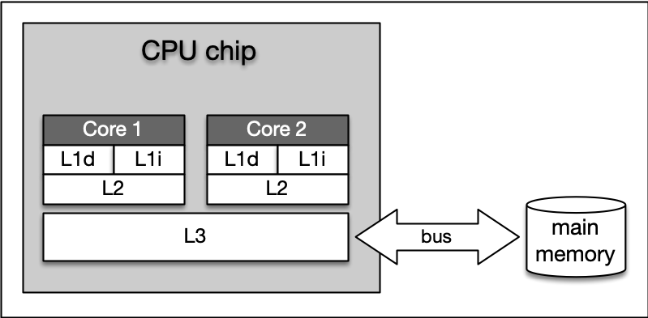

# 4. Memory Management
## 4.1. Debugging (`gdb`)
```
g++ -g main.cpp
```
Then
```
gdb a.out
```
[GDB cheat sheet](./GDB_Cheat_Sheet.pdf) gives you more detail about debugging using gdb.
[Source](https://darkdust.net/files/GDB%20Cheat%20Sheet.pdf)

## 4.2. Types of Computer Memory


## 4.3. Cache Memory
System architecture diagram showing caches, ALU (arithmetic logic unit), main memory, 
and the buses connected each component:


The concept of L1 and L2 (and even L3) cache is further illustrated by the following 
figure, which shows a multi-core CPU and its interplay with L1, L2 and L3 caches:

In the above figure:
* L1d and L1i represent memory space for data and instructions respectively.
* Size
  * L1: 16 to 64 kBytes
  * L2: at or below 2 megabytes
* **Level 3 Caches** is shared among all cores of a multicore processor. With the L3 cache, 
  the [cache coherence](https://en.wikipedia.org/wiki/Cache_coherence) protocol of multicore 
  processors can work much faster. This protocol compares the caches of all cores to maintain
  data consistency so that all processors have access to the same data at the same time. 
  The L3 cache therefore has less the function of a cache, but is intended to simplify and 
  accelerate the cache coherence protocol and the data exchange between the cores.

Command to know cache information on linux:
```
lscpu | grep cache
```

## 4.3.1. Temporal and Spatial Locality
* **Temporal Locality** means that address ranges that are accessed are likely to be used 
  again in the near future. In the course of time, the same memory address is accessed relatively 
  frequently (e.g. in a loop). This property can be used at all levels of the memory hierarchy to 
  keep memory areas accessible as quickly as possible.
* **Spatial Locality** means that after an access to an address range, the next access to an 
  address in the immediate vicinity is highly probable (e.g. in arrays). In the course of time, 
  memory addresses that are very close to each other are accessed again multiple times. This 
  can be exploited by moving the adjacent address areas upwards into the next hierarchy level 
  during a memory access.
  