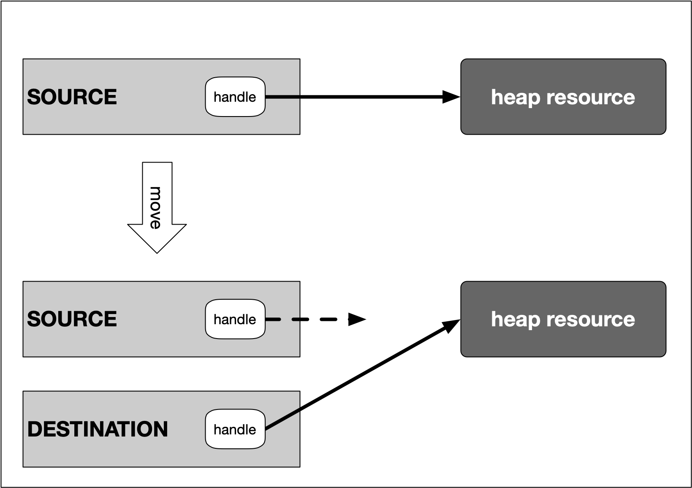

# 4. Memory Management
## 4.1. Debugging (`gdb`)
```
g++ -g main.cpp
```
Then
```
gdb a.out
```
[GDB cheat sheet](./GDB_Cheat_Sheet.pdf) gives you more detail about debugging using gdb.
[Source](https://darkdust.net/files/GDB%20Cheat%20Sheet.pdf)

## 4.2. Types of Computer Memory


## 4.3. Cache Memory
System architecture diagram showing caches, ALU (arithmetic logic unit), main memory, 
and the buses connected each component:


The concept of L1 and L2 (and even L3) cache is further illustrated by the following 
figure, which shows a multi-core CPU and its interplay with L1, L2 and L3 caches:


In the above figure:
* L1d and L1i represent memory space for data and instructions respectively.
* Size
  * L1: 16 to 64 kBytes
  * L2: at or below 2 megabytes
* **Level 3 Caches** is shared among all cores of a multicore processor. With the L3 cache, 
  the [cache coherence](https://en.wikipedia.org/wiki/Cache_coherence) protocol of multicore 
  processors can work much faster. This protocol compares the caches of all cores to maintain
  data consistency so that all processors have access to the same data at the same time. 
  The L3 cache therefore has less the function of a cache, but is intended to simplify and 
  accelerate the cache coherence protocol and the data exchange between the cores.

Command to know cache information on linux:
```
lscpu | grep cache
```

### 4.3.1. Temporal and Spatial Locality
* **Temporal Locality** means that address ranges that are accessed are likely to be used 
  again in the near future. In the course of time, the same memory address is accessed relatively 
  frequently (e.g. in a loop). This property can be used at all levels of the memory hierarchy to 
  keep memory areas accessible as quickly as possible.
* **Spatial Locality** means that after an access to an address range, the next access to an 
  address in the immediate vicinity is highly probable (e.g. in arrays). In the course of time, 
  memory addresses that are very close to each other are accessed again multiple times. This 
  can be exploited by moving the adjacent address areas upwards into the next hierarchy level 
  during a memory access.

## 4.4. Virtual Memory
### 4.4.1. Problems with Physical Mermory
* The idea of virtual memory stems back from a (not so long ago) time, when the random access 
  memory (RAM) of most computers was severely limited. Programers needed to treat memory as a 
  precious resource and use it most efficiently. Also, they wanted to be able to run programs 
  even if there was not enough RAM available.
* **Holes in address space**: If several programs are started one after the other and then 
  shortly afterwards some of these are terminated again, it must be ensured that the freed-up 
  space in between the remaining programs does not remain unused. If memory becomes too fragmented, 
  it might not be possible to allocate a large block of memory due to a large-enough free contiguous 
  block not being available any more.
* **Programs writing over each other**: If several programs are allowed to access the same memory 
  address, they will overwrite each others' data at this location. In some cases, this might even 
  lead to one program reading sensitive information (e.g. bank account info) that was written by 
  another program. This problem is of particular concern when writing concurrent programs which 
  run several threads at the same time.

The basic idea of virtual memory is to separate the addresses a program may use from the addresses 
in physical computer memory. By using a mapping function, an access to (virtual) program memory 
can be redirected to a real address which is guaranteed to be protected from other programs.


With virtual memory, the RAM acts as a cache for the virtual memory space which resides on 
secondary storage devices.

1) In a nutshell, virtual memory guarantees us a fixed-size address space which is largely independent 
of the system configuration. Also, 2) the **OS** guarantees that the virtual address spaces of different 
programs do not interfere with each other.

* A **memory page** is a number of directly successive memory locations in virtual memory defined by the 
  computer architecture and by the operating system. The computer memory is divided into memory pages of 
  equal size. The use of memory pages enables the operating system to perform virtual memory management. 
  The entire working memory is divided into tiles and each address in this computer architecture is interpreted 
  by the *Memory Management Unit (MMU)* as a logical address and converted into a physical address.
* A **memory frame** is mostly identical to the concept of a memory page with the key difference being 
  its location in the physical main memory instead of the virtual memory.


As can be seen, both processes have their own virtual memory space. Some of the pages are mapped to 
frames in the physical memory and some are not. If process 1 needs to use memory in the memory page 
that starts at address 0x1000, a page fault will occur if the required data is not there. The memory 
page will then be mapped to a vacant memory frame in physical memory. Also, note that the virtual 
memory addresses are not the same as the physical addresses. The first memory page of process 1, 
which starts at the virtual address 0x0000, is mapped to a memory frame that starts at the physical 
address 0x2000.

In summary, virtual memory management is performed by the operating system and programmers do usually 
not interfere with this process. The major benefit is a unique perspective on a chunk of memory for 
each program that is only limited in its size by the architecture of the system (32 bit, 64 bit) and 
by the available physical memory, including the hard disk.

## 4.5. The Process Memory Model
  
Each program is assigned its own virtual memory by the operating system. This address space is arranged 
in a linear fashion with one block of data being stored at each address. It is also divided into several 
distinct areas as illustrated by the figure below:


In a 32-bit computer, the address space has 32 bits and hence `2^32` entries, while in a 64-bit system,
the address space has 64 bits which is a very (close to unlimited!) memory space.

In the above figure, *Text* block contains the programs and instructions generated by compiler and linker. 
In addition the *OS Kernel Space* includes the kernel code which is controlled by OS.

* **Stack**
  * The stack is a contiguous memory block with a fixed maximum size.
  * If a program exceeds this size, it will crash.
  * The stack is used for storing automatically allocated variables such as local variables or function parameters.
  * If there are multiple threads in a program, then each thread has its own stack memory.
  * New memory on the stack is allocated when the path of execution enters a scope and freed again once the scope is left.
  * It is important to know that the stack is managed "automatically" by the compiler, which means we do not have 
    to concern ourselves with allocation and deallocation.
* **Heap**
  * The heap (also called "free store" in C++) is where data with dynamic storage lives. 
  * It is shared among multiple threads in a program, which means that memory management 
    for the heap needs to take concurrency into account. This makes memory allocations in 
    the heap more complicated than stack allocations.
  * In general, managing memory on the heap is more (computationally) expensive for the 
    operating system, which makes it slower than stack memory.
  * Contrary to the stack, the heap is not managed automatically by the system, but by the programmer.
  * If memory is allocated on the heap, it is the programmer’s responsibility to free it again when it 
    is no longer needed. If the programmer manages the heap poorly or not at all, there will be trouble.

* **The BSS (Block Started by Symbol)**
  * The BSS segment is used in many compilers and linkers for a segment that contains global and static 
    variables that are initialized with zero values.
  * This memory area is suitable, for example, for arrays that are **not initialized** with predefined values.

* **Data**
  * The data segment serves the same purpose as the BSS segment with the major difference being that 
    variables in the Data segment have been **initialized** with a value other than zero.
  * Memory for variables in the Data segment (and in BSS) is allocated once when a program is 
    run and persists throughout its lifetime.

## 4.6. Memory Allocation in C++
*Allocating* a memory space to a variable name means there is a memory space assigned to that variable. 
*Deallocating* means when the system has no longer any claim on that space by the variable name.

Generally, three types of memory allocation is supported:
1. **Static** memory allocation is performed for static and global variables, which are stored in 
  the BSS and Data segment. Memory for these types of variables is allocated once when your 
  program is run and persists throughout the life of your program.

2. **Automatic** memory allocation is performed for function parameters as well as local variables, 
  which are stored on the stack. Memory for these types of variables is allocated when the path 
  of execution enters a scope and freed again once the scope is left.

3. **Dynamic** memory allocation is a possibility for programs to request memory from the operating 
  system at runtime when needed. This is the major difference to automatic and static allocation, 
  where the size of the variable must be known at compile time. Dynamic memory allocation is not 
  performed on the limited stack but on the heap and is thus (almost) only limited by the size of 
  the address space.

## 4.7. Automatic Memory Allocation (The Stack)
The stack is the place in virtual memory where the local variables reside, including arguments to 
functions. Each time a function is called, the stack grows (from top to bottom) and each time a 
function returns, the stack contracts. When using multiple threads (as in concurrent programming), 
it is important to know that each thread has its own stack memory - which can be considered thread-safe.

1. The stack is a **contiguous block of memory**. It will not become fragmented (as opposed to the heap) 
  and it has a fixed maximum size.
2. When the **maximum size** of the stack memory is exceeded, a program will crash.
3. Allocating and deallocating memory is **fast** on the stack. It only involves moving the stack pointer 
  to a new position.

To check the stack size on linux machine run:
```
ulimit -s
```

## 4.8. Call by Reference vs. Call by Value
Drawbacks of passing by value:
1. Passing parameters by value means that a copy is created, which is an expensive operation that might 
  consume large amounts of memory, depending on the data that is being transferred. Later in we will 
  encounter "move semantics", which is an effective way to compensate for this downside.
2. Passing by value also means that the created copy can not be used as a back channel for communicating 
  with the caller, for example by directly writing the desired information into the variable.

We can create a back channel between caller and callee by a pointer. If a function gets a pointer as 
an argument, then by passing the address of a variable the function can modify the variable within 
the function. However, the first drawback still exist since the function creates a local variable 
containing the address of its argument. Example:

```cpp
#include <iostream>

void AddThree(int *val)
{
    *val += 3;
}

int main()
{
    int val = 0;
    AddThree(&val);
    val += 2;

    std::cout << "val = " << val << std::endl;
 
    return 0;
}
```

In contrast, in passing by reference the function receives a reference to the parameter, rather than 
a copy of its value. The function can now modify the argument such that the changes also happen on 
the caller side. Passing by reference is faster as no information needs to be copied and less stack 
memory required. Example:

```cpp
#include <iostream>

void AddFour(int &val)
{
    val += 4;
}

int main()
{
    int val = 0;
    AddFour(val);
    val += 2;

    std::cout << "val = " << val << std::endl;
 
    return 0;
}
```

### 4.8.1. Pointers vs. References
* Pointers can be declared without initialization. This means we can pass an uninitialized pointer 
  to a function who then internally performs the initialization for us.
* Pointers can be reassigned to another memory block on the heap.
* References are usually easier to use (depending on the expertise level of the programmer). 
  Sometimes however, if a third-party function is used without properly looking at the 
  parameter definition, it might go unnoticed that a value has been modified.

Example:

```cpp
#include <iostream>

void AddFour(int &val){   //pasing by reference
    val += 4;
}

void AddSix(int *val){    //passing by pointer
    *val += 6; 
}

int main(){
    int val = 0;
    AddFour(val);
    AddSix(&val);

    std::cout << "val = " << val << std::endl;
 
    return 0;
}
```

### 4.8.2. Three ways to pass a value to a function

```cpp
#include <stdio.h>
    
void CallByValue(int i){
    int j = 1; 
    printf ("call-by-value: %p\n",&j);
}

void CallByPointer(int *i){
    int j = 1; 
    printf ("call-by-pointer: %p\n",&j);
}

void CallByReference(int &i){
    int j = 1; 
    printf ("call-by-reference: %p\n",&j);
}

int main(){
    int i = 0;
    printf ("stack bottom: %p\n",&i); //as the bottom of stack address
    
    CallByValue(i);
    CallByPointer(&i);
    CallByReference(i);  //from here we cannot say whether it's pass by value or reference?!!

    return 0;
}
```

After running the above code, we expect the `CallByValue()` takes more space on the stack, 
however, it's not the case always. The reason is if the system is a 64-bit computer, the 
size of pointer is 8 bytes and the size of the value itself is 4 bytes. 

In order to benefit from call-by-reference, the size of the data type passed to the function 
has to surpass the size of the pointer on the respective architecture (i.e. 32 bit or 64 bit).

## 4.9. Heap Memory
* As opposed to local variables on the stack, memory can now be allocated in an arbitrary scope 
  (e.g. inside a function) without it being deleted when the scope is left. Thus, as long as the 
  address to an allocated block of memory is returned by a function, the caller can freely use it.

* Local variables on the stack are allocated at **compile-time**. Thus, the size of e.g. a string 
  variable might not be appropriate as the length of the string will not be known until the program 
  is executed and the user inputs it. With local variables, a solution would be to allocate a 
  long-enough array of and hope that the actual length does not exceed the buffer size. With dynamically 
  allocated heap memory, variables are allocated at **run-time**. This means that the size of the 
  above-mentioned string variable can be tailored to the actual length of the user input.

* Heap memory is only constrained by the size of the address space and by the available memory. With 
  modern 64 bit operating systems and large RAM memory and hard disks the programmer commands a vast 
  amount of memory. However, if the programmer forgets to deallocate a block of heap memory, it will 
  remain unused until the program is terminated. This is called a **memory leak**.

* Unlike the stack, the heap is **shared** among multiple **threads**, which means that memory management 
  for the heap needs to take concurrency into account as several threads might compete for the same 
  memory resource.

* When memory is allocated or deallocated on the stack, the stack pointer is simply shifted upwards or downwards. 
  Due to the sequential structure of stack memory management, stack memory can be managed (by the operating 
  system) easily and securely. With heap memory, allocation and deallocation can occur arbitrarily, depending 
  on the lifetime of the variables. This can result in **fragmented memory** over time, which is much more 
  difficult and expensive to manage.

### 4.9.1. Memory Fragmentation
A classic symptom of memory fragmentation is that you try to allocate a large block and you can’t, 
even though you appear to have enough memory free. On systems with virtual memory however, this 
is less of a problem, because large allocations only need to be contiguous in virtual address space, 
not in physical address space.

When memory is heavily fragmented however, memory allocations will likely take longer because the memory 
allocator has to do more work to find a suitable space for the new object.

## 4.10. Using `malloc` and `free`
To reserve memory on the heap, one of the two functions `malloc` (stands for *Memory Allocation*) or 
`calloc` (stands for *Cleared Memory Allocation*) is used. The header file `stdlib.h` or `malloc.h` 
must be included to use the functions.

Here is the syntax of malloc and calloc in C/C++:

```cpp
pointer_name = (cast-type*) malloc(size);
pointer_name = (cast-type*) calloc(num_elems, size_elem);
```

`malloc` is used to dynamically allocate a single large block of memory with the specified size. 
It returns a pointer of type void which can be cast into a pointer of any form.

`calloc` is used to dynamically allocate the specified number of blocks of memory of the specified 
type. It initializes each block with a default value '0'.

Both functions return a pointer of type void which can be cast into a pointer of any form. 
If the space for the allocation is insufficient, a NULL pointer is returned.

Example:
```cpp
struct MyStruct {
    int i; 
    double d; 
    char a[5];
};

MyStruct *p = (MyStruct*)calloc(4,sizeof(MyStruct));
p[0].i = 1; p[0].d = 3.14159; p[0].a[0] = 'a';
```

The size of the memory area reserved with `malloc` or `calloc` can be increased or decreased 
with the `realloc` function.

```cpp
pointer_name = (cast-type*) realloc( (cast-type*)old_memblock, new_size );
```

We can use `free` function to free the allocated memory on the heap using `malloc` or 
`calloc` as the following example:

```cpp
#include <stdio.h>
#include <stdlib.h>

int main()
{
    void *p = malloc(100); 
    free(p);

    return 0;
}
```

### 4.10.1. Dangling Pointer
In the following example, a pointer `p` is copied into a new variable `p2`, which is then passed to 
`free` AFTER the original pointer has been already released.

```
free(41143,0x1000a55c0) malloc: *** error for object 0x1003001f0: pointer being freed was not allocated.
```

In the workspace, you will see this error:

```
*** Error in './a.out': double free or corruption (fasttop): 0x0000000000755010 ***
```

```cpp
#include <stdio.h>
#include <stdlib.h>

int main()
{
    void *p = malloc(100); 
    void *p2 = p;
    
    free(p); // OK
    free(p2); // ERROR

    return 0;
}
```

The pointer `p2` in the example is invalid as soon as `free(p)` is called. It still holds the address 
to the memory location which has been freed, but may not access it anymore. Such a pointer is 
called a "**dangling pointer**".

Memory allocated with `malloc` or `calloc` is not subject to the familiar rules of variables in their 
respective scopes. This means that they exist independently of block limits until they are released again 
or the program is terminated. However, the pointers which refer to such heap-allocated memory are created 
on the stack and thus only exist within a limited scope. As soon as the scope is left, the pointer variable 
will be lost - but not the heap memory it refers to.

## 4.11. Using `new` and `delete`
`new` and `delete` are operators while `malloc` and `free` are library function.

If we were to create a C++ object with `malloc`, the constructor and destructor of such an object 
would not be called.

1. **Constructors / Destructors**: Unlike `malloc( sizeof(MyClass) )`, the call `new MyClass()` calls 
  the constructor. Similarly, delete calls the destructor.
2. **Type safety**: `malloc` returns a void pointer, which needs to be cast into the appropriate 
  data type it points to. This is not type safe, as you can freely vary the pointer type without 
  any warnings or errors from the compiler as in the following small example:
  ```MyObject *p = (MyObject*)malloc(sizeof(int));```
3. **Operator Overloading**: As `malloc` and `free` are functions defined in a library, their behavior 
  can not be changed easily. The new and delete operators however can be overloaded by a class in order 
  to include optional proprietary behavior.

As with with `malloc` and `new`, a call to `new` has to be followed by a call to `delete`. 
Otherwise it will yields to *memory leak*.

```cpp
#include <stdlib.h>
#include <iostream>

class MyClass
{
private:
    int *_number;

public:
    MyClass()
    {
        std::cout << "Allocate memory\n";
        _number = (int *)malloc(sizeof(int));
    }
    ~MyClass()
    {
        std::cout << "Delete memory\n";
        free(_number);
    }
    void setNumber(int number)
    {
        *_number = number;
        std::cout << "Number: " << _number << "\n";
    }
};


int main()
{
    // allocate memory using malloc
    // will throw error, because _number has not been allocated yet.
    MyClass *myClass = (MyClass *)malloc(sizeof(MyClass));
    myClass->setNumber(42); // EXC_BAD_ACCESS
    free(myClass);
	  
	// allocate memory using new
    MyClass *myClass = new MyClass();
    myClass->setNumber(42); // works as expected
    delete myClass;

    return 0;
}
```

### 4.11.1. Optimizing performance with `palcement new`
In some cases, it makes sense to separate memory allocation from object construction. 
Consider a case where we need to reconstruct an object several times. If we were to 
use the standard `new`/`delete` construct, memory would be allocated and freed unnecessarily 
as only the content of the memory block changes but not its size. By separating allocation from 
construction, we can get a significant performance increase.

C++ allows us to do this by using a construct called `placement new`: With `placement new`, 
we can pass a preallocated memory and construct an object at that memory location. 
Consider the following code:
```cpp
void *memory = malloc(sizeof(MyClass));
MyClass *object = new (memory) MyClass;
```
The syntax `new (memory)` is denoted as placement new. The difference to the "conventional" new 
we have been using so far is that no memory is allocated. The call constructs an object and 
places it in the assigned memory location. There is however, no delete equivalent to placement new, 
so we have to call the **destructor** explicitly in this case instead of using `delete` as we would 
have done with a regular call to new:
```cpp
object->~MyClass();
free(memory);
```

### 4.11.2. Overloading `new` and `delete`
One advantage of `new`/`delete` over `malloc`/`free` is that we can overload `new`/`delete` and change
their behavior.

The syntax for overloading the new and delete operator looks as follows
```cpp
void* operator new(size_t size);
void operator delete(void*);
```

Example: 

```cpp
#include <iostream>
#include <stdlib.h>

class MyClass
{
    int _mymember;

public:
    MyClass()
    {
        std::cout << "Constructor is called\n";
    }

    ~MyClass()
    {
        std::cout << "Destructor is called\n";
    }

    void *operator new(size_t size)
    {
        std::cout << "new: Allocating " << size << " bytes of memory" << std::endl;
        void *p = malloc(size);

        return p;
    }

    void operator delete(void *p)
    {
        std::cout << "delete: Memory is freed again " << std::endl;
        free(p);
    }
};

int main()
{
    MyClass *p = new MyClass();
    delete p;
}
```

### 4.11.3. Overloading `new[]` and `delete[]`
we can use the following code to create an array of objects:
```cpp
void* operator new[](size_t size);
void operator delete[](void*);
```

Example:

```cpp
#include <iostream>
#include <stdlib.h>

class MyClass
{
    int _mymember;

public:
    MyClass()
    {
        std::cout << "Constructor is called\n";
    }

    ~MyClass()
    {
        std::cout << "Destructor is called\n";
    }

    void *operator new[](size_t size)
    {
        std::cout << "new: Allocating " << size << " bytes of memory" << std::endl;
        void *p = malloc(size);

        return p;
    }

    void operator delete[](void *p)
    {
        std::cout << "delete: Memory is freed again " << std::endl;
        free(p);
    }
};

int main()
{
    MyClass *p = new MyClass[3]();
    delete[] p;
}
```

The output for the above code looks as follows:
```
new: Allocating 20 bytes of memory
Constructor is called
Constructor is called
Constructor is called
Destructor is called
Destructor is called
Destructor is called
delete: Memory is freed again 
```

Interestingly, the memory requirement is larger than expected: With new, the block size was 4 bytes, 
which is exactly the space required for a single integer. Thus, with three integers, it should now 
be 12 bytes instead of 20 bytes. The reason for this is the memory allocation overhead that the compiler 
needs to keep track of the allocated blocks of memory - which in itself consumes memory. If we change 
the above call to e.g. `new MyClass[100]()`, we will see that the overhead of 8 bytes does not change:

```
new: Allocating 408 bytes of memory
Constructor is called
…
Destructor is called
delete: Memory is freed again 
```

### 4.11.4. Reasons for overloading `new` and `delete`
1. The overloaded new operator function allows to add additional parameters. 
  Therefore, a class can have multiple overloaded new operator functions. This gives the 
  programmer more flexibility in customizing the memory allocation for objects.
2. Overloaded the new and delete operators provides an easy way to integrate a mechanism 
  similar to garbage collection capabilities (such as in Java).
3. By adding exception handling capabilities into new and delete, the code can be made more robust.
4. It is very easy to add customized behavior, such as overwriting deallocated memory with zeros in 
  order to increase the security of critical application data.

## 4.12. Overview of memory management problems
* Memory Leaks
* Buffer Overruns
* Uninitialized Memory: Generally, a variable will be automatically initialized in these cases:
  * it is a class instance where the default constructor initializes all primitive types
  * array initializer syntax is used, such as `int a[10] = {}`
  * it is a global or extern variable
  * it is defined `static`
* Incorrect pairing of allocation and deallocation
* Invalid memory access

## 4.13. Copy Semantics
The default behavior of both *copy constructor* and *assignment operator* is to perform a 
**shallow** copy as with the example above.


Fortunately, in C++, the copying process can be controlled by defining a tailored copy constructor 
as well as a copy assignment operator. The copying process must be closely linked to the respective 
resource release mechanism and is often referred to as *copy-ownership policy*. Tailoring the copy 
constructor according to your memory management policy is an important choice you often need to make 
when designing a class.

### 4.13.1. No Copying Policy
The simplest policy of all is to forbid copying and assigning class instances all together. 
This can be achieved by 1) declaring, but not defining a private copy constructor and assignment 
operator OR 2) alternatively by making both public and assigning the delete operator. 

The second choice is more explicit and makes it clearer to the programmer that copying has been 
actively forbidden.

```cpp
class NoCopyClass1
{
private:
    NoCopyClass1(const NoCopyClass1 &);
    NoCopyClass1 &operator=(const NoCopyClass1 &);

public:
    NoCopyClass1(){};
};

class NoCopyClass2
{
public:
    NoCopyClass2(){}
    NoCopyClass2(const NoCopyClass2 &) = delete;
    NoCopyClass2 &operator=(const NoCopyClass2 &) = delete;
};

int main()
{
    NoCopyClass1 original1;
    NoCopyClass1 copy1a(original1); // copy c’tor
    NoCopyClass1 copy1b = original1; // assigment operator

    NoCopyClass2 original2;
    NoCopyClass2 copy2a(original2); // copy c’tor
    NoCopyClass2 copy2b = original2; // assigment operator

    return 0;
}
```

On compiling, we get the following error messages:

```
error: calling a private constructor of class 'NoCopyClass1'
    NoCopyClass1 copy1(original1);
    NoCopyClass1 copy1b = original1; 

error: call to deleted constructor of 'NoCopyClass2'
    NoCopyClass2 copy2(original2);
    NoCopyClass2 copy2b = original2; 
```

Both cases effectively prevent the original object from being copied or assigned. 
In the C++11 standard library, there are some classes for multi-threaded synchronization which 
use the no copying policy.

### 4.13.2. Exclusive Ownership Policy
This policy states that whenever a resource management object is copied, the resource handle 
is transferred from the source pointer to the destination pointer. In the process, the source 
pointer is set to `nullptr` to make ownership exclusive. At any time, the resource handle belongs 
only to a single object, which is responsible for its deletion when it is no longer needed.

```cpp
#include <iostream>

class ExclusiveCopy
{
private:
    int *_myInt;

public:
    ExclusiveCopy()
    {
        _myInt = (int *)malloc(sizeof(int));
        std::cout << "resource allocated" << std::endl;
    }
    ~ExclusiveCopy()
    {
        if (_myInt != nullptr)
        {
            free(_myInt);
            std::cout << "resource freed" << std::endl;
        }
            
    }
    ExclusiveCopy(ExclusiveCopy &source)
    {
        _myInt = source._myInt;
        source._myInt = nullptr;
    }
    ExclusiveCopy &operator=(ExclusiveCopy &source)
    {
        _myInt = source._myInt;
        source._myInt = nullptr;
        return *this;
    }
};

int main()
{
    ExclusiveCopy source;
    ExclusiveCopy destination(source);

    return 0;
}
```

This example is not the way exclusive ownership is handled in the standard template library. 
One problem in this implementation is that for a short time there are effectively two valid 
handles to the same resource - after the handle has been copied and before it is set to `nullptr`. 
In concurrent programs, this would cause a data **race** for the resource. A much better alternative 
to handle exclusive ownership in C++ would be to use move semantics.

### 4.13.3. Deep Copying Policy
With this policy, copying and assigning class instances to each other is possible without the 
danger of resource conflicts. The idea is to allocate proprietary memory in the destination object 
and then to copy the content to which the source object handle is pointing into the newly allocated 
block of memory. This way, the content is preserved during copy or assignment. However, this approach 
increases the memory demands and the uniqueness of the data is lost: After the deep copy has been made, 
two versions of the same resource exist in memory.

```cpp
#include <iostream>

class DeepCopy
{
private:
    int *_myInt;

public:
    DeepCopy(int val)
    {
        _myInt = (int *)malloc(sizeof(int));
        *_myInt = val;
        std::cout << "resource allocated at address " << _myInt << std::endl;
    }
    ~DeepCopy()
    {
        free(_myInt);
        std::cout << "resource freed at address " << _myInt << std::endl;
    }
    DeepCopy(DeepCopy &source)
    {
        _myInt = (int *)malloc(sizeof(int));
        *_myInt = *source._myInt;
        std::cout << "resource allocated at address " << _myInt << " with _myInt = " << *_myInt << std::endl;
    }
    DeepCopy &operator=(DeepCopy &source)
    {
        _myInt = (int *)malloc(sizeof(int));
        std::cout << "resource allocated at address " << _myInt << " with _myInt=" << *_myInt << std::endl;
        *_myInt = *source._myInt;
        return *this;
    }
};

int main()
{
    DeepCopy source(42);
    DeepCopy dest1(source);
    DeepCopy dest2 = dest1;

    return 0;
}
```

The output of the program looks like the following:

```
resource allocated at address 0x100300060
resource allocated at address 0x100300070 with _myInt = 42
resource allocated at address 0x100300080 with _myInt = 42
resource freed at address 0x100300080
resource freed at address 0x100300070
resource freed at address 0x100300060
```

As can be seen, all copies have the same value of 42 while the address of the handle 
differs between `source`, `dest1` and `dest2`.

### 4.13.4. Shared Ownership Policy
The idea is to perform a copy or assignment similar to the default behavior, i.e. copying 
the handle instead of the content (as with a shallow copy) while at the same time keeping 
track of the number of instances that also point to the same resource. Each time an instance 
goes out of scope, the counter is decremented. Once the last object is about to be deleted, 
it can safely deallocate the memory resource. We will see later in this course that this is 
the central idea of `unique_ptr`, which is a representative of the group of smart pointers.

```cpp
#include <iostream>

class SharedCopy
{
private:
    int *_myInt;
    static int _cnt;

public:
    SharedCopy(int val);
    ~SharedCopy();
    SharedCopy(SharedCopy &source);
};

int SharedCopy::_cnt = 0;

SharedCopy::SharedCopy(int val)
{
    _myInt = (int *)malloc(sizeof(int));
    *_myInt = val;
    ++_cnt;
    std::cout << "resource allocated at address " << _myInt << std::endl;
}

SharedCopy::~SharedCopy()
{
    --_cnt;
    if (_cnt == 0)
    {
        free(_myInt);
        std::cout << "resource freed at address " << _myInt << std::endl;
    }
    else
    {
        std::cout << "instance at address " << this << " goes out of scope with _cnt = " << _cnt << std::endl;
    }
}

SharedCopy::SharedCopy(SharedCopy &source)
{
    _myInt = source._myInt;
    ++_cnt;
    std::cout << _cnt << " instances with handles to address " << _myInt << " with _myInt = " << *_myInt << std::endl;
}

int main()
{
    SharedCopy source(42);
    SharedCopy destination1(source);
    SharedCopy destination2(source);
    SharedCopy destination3(source);

    return 0;
}
```

The output of the program is the following:

```
resource allocated at address 0x100300060
2 instances with handles to address 0x100300060 with _myInt = 42
3 instances with handles to address 0x100300060 with _myInt = 42
4 instances with handles to address 0x100300060 with _myInt = 42
instance at address 0x7ffeefbff6f8 goes out of scope with _cnt = 3
instance at address 0x7ffeefbff700 goes out of scope with _cnt = 2
instance at address 0x7ffeefbff718 goes out of scope with _cnt = 1
resource freed at address 0x100300060
```

As can be seen, the memory is released only once as soon as the reference counter reaches zero.

The **Rule of Three** states that if a class needs to have an overloaded copy constructor, copy 
assignment operator, ~or~ destructor, then it must also implement the other two as well to ensure 
that memory is managed consistently.

## 4.14. Lvalues and Rvalues
* **Lvalues** have an address that can be accessed. They are expressions whose evaluation by the 
  compiler determines the identity of objects or functions.
* **Prvalues** (Rvalues) do not have an address that is accessible directly. They are temporary expressions 
  used to initialize objects or compute the value of the operand of an operator.
  
In more general terms, an lvalue is an entity that points to a specific memory location. An rvalue 
is usually a short-lived object, which is only needed in a narrow local scope.

```cpp
int main()
{
    // initialize some variables on the stack
    int i, j, *p;

    // correct usage of lvalues and rvalues
    
    i = 42; // i is an lvalue and 42 is an rvalue
    
    p = new int;
    *p = i; // the dereferenced pointer is an lvalue
    delete p; 
    
    ((i < 42) ? i : j) = 23; // the conditional operator returns an lvalue (eiter i or j)

    // incorrect usage of lvalues and rvalues
    //42 = i; // error : the left operand must be an lvalue
    //j * 42 = 23; // error : the left operand must be an lvalue

    return 0; 
}
```

### 4.14.1. Lvalue References
An lvalue reference can be considered as an alternative name for an object. It is a 
reference that binds to an lvalue and is declared using an optional list of specifiers 
followed by the reference declarator `&`. The following code sample declares an integer 
`i` and a reference `j` which can be used as an alias for the existing object.

```cpp
#include <iostream>

int main()
{
    int i = 1; 
    int &j = i; 
    ++i;
    ++j;

    std::cout << "i = " << i << ", j = " << j << std::endl;

    return 0;
}
```

The output of the program is

```
i = 3, j = 3
```

We can see that the lvalue reference `j` can be used just as `i` can. A change to either `i` 
or `j` will affect the same memory location on the stack.

One of the primary use-cases for lvalue references is the pass-by-reference semantics in 
function calls as in the following example.

```cpp
#include <iostream>

void myFunction(int &val)
{
    ++val;
}

int main()
{
    int i = 1; 
    myFunction(i);

    std::cout << "i = " << i << std::endl;

    return 0;
}
```

The function `myFunction` has an lvalue reference as a parameter, which establishes an alias 
to the integer `i` which is passed to it in `main`.

### 4.14.2. Rvalue References

```cpp
#include <iostream>

void myFunction(int &val)
{
    std::cout << "val = " << val << std::endl;
}

int main()
{
    int j = 42;
    myFunction(j);

    myFunction(42);

    int k = 23; 
    myFunction(j+k);

    return 0; 
}
```

In the above example, the last two `myFunction` calls throw errors because the argument 
is not an lvalue.

Since C++11, there is a new type available called *rvalue reference*, which can be identified 
from the double ampersand `&&` after a type name. With this operator, it is possible to store 
and even modify an rvalue, i.e. a temporary object which would otherwise be lost quickly.

```cpp
#include <iostream>

int main()
{
    int i = 1; 
    int j = 2; 
    int k = i + j; 
    int &&l = i + j; 

    std::cout << "k = " << k << ", l = " << l << std::endl;

    return 0; 
}
```

After creating the integers `i` and `j` on the stack, the sum of both is added to a third 
integer `k`. In the first and second assignment, `i` and `j` are created as lvalues, while 
`1` and `2` are rvalues, whose value is copied into the memory location of `i` and `j`. 
Then, a third lvalue, `k`, is created. The sum `i+j` is created as an rvalue, which holds 
the result of the addition before being copied into the memory location of `k`. This is 
quite a lot of copying and holding of temporary values in memory. With an rvalue reference, 
this can be done more efficiently.

The expression `int &&l` creates an rvalue reference, to which the address of the temporary 
object is assigned, that holds the result of the addition. So instead of first creating the 
rvalue `i+j`, then copying it and finally deleting it, we can now hold the temporary object 
in memory. This is much more efficient than the first approach, even though saving a few bytes 
of storage in the example might not seem like much at first glance. One of the most important 
aspects of rvalue references is that they pave the way for move semantics, which is a mighty 
technique in modern C++ to optimize memory usage and processing speed. Move semantics and rvalue 
references make it possible to write code that transfers resources such as dynamically allocated 
memory from one object to another in a very efficient manner and also supports the concept of 
exclusive ownership.

## 4.15. Move Semantics

### 4.15.1. Rvalue references and `std::move`

```cpp
#include <iostream>

void myFunction(int &&val)
{
    std::cout << "val = " << val << std::endl;
}

int main()
{
    myFunction(42);

    return 0; 
}
```

The important message of the function argument of `myFunction` to the programmer is: 
*The object that binds to the rvalue reference &&val is yours*, it is not needed anymore 
within the scope of the caller (which is `main`). This is interesting from two perspectives:

1. Passing values like this **improves performance** as no temporary copy needs to be 
  made anymore and
2. **ownership changes**, since the object the reference binds to has been abandoned by the 
  caller and now binds to a handle which is available only to the receiver. This could not 
  have been achieved with lvalue references as any change to the object that binds to the 
  lvalue reference would also be visible on the caller side.
  
*Rvalue references are themselves lvalues*. While this might seem confusing at first glance, 
it really is the mechanism that enables move semantics: A reference is always defined in a 
certain context (such as in the above example the variable val). Even though the object it 
refers to (the number 42) may be disposable in the context it has been created (the main function), 
it is not disposable in the context of the reference . So within the scope of `myFunction`, `val` 
is an lvalue as it gives access to the memory location where the number 42 is stored.

Note however that in the above code example we cannot pass an lvalue to myFunction, 
because an rvalue reference cannot bind to an lvalue. The code

```cpp
int i = 23;
myFunction(i)
```

would result in a compiler error. There is a solution to this problem though: The function 
`std::move` converts an lvalue into an rvalue (actually, to be exact, into an xvalue), 
which makes it possible to use the lvalue as an argument for the function:

```cpp
int i = 23; 
myFunction(std::move(i));
```

In doing this, we state that in the scope of `main` we will not use `i` anymore, which 
now exists only in the scope of `myFunction`.

### 4.15.2. Rule of Three

```cpp
#include <stdlib.h>
#include <iostream>

class MyMovableClass
{
private:
    int _size;
    int *_data;

public:
    MyMovableClass(size_t size) // constructor
    {
        _size = size;
        _data = new int[_size];
        std::cout << "CREATING instance of MyMovableClass at " << this << " allocated with size = " << _size*sizeof(int)  << " bytes" << std::endl;
    }

    ~MyMovableClass() // 1 : destructor
    {
        std::cout << "DELETING instance of MyMovableClass at " << this << std::endl;
        delete[] _data;
    }
    
    MyMovableClass(MyMovableClass &source){
        _size = source._size;
        _data = new int[_size];
        *_data = *source._data;
        std::cout << "COPYING content of instance " << &source << " to instance " << this << std::endl;
    }

    MyMovableClass &operator=(const MyMovableClass &source){
        std::cout << "ASSIGNING content of " << &source << " to instance " << this << std::endl;
        if (this == &source)
            return *this;
        delete[] _data;
        _size = source._size;
        _data = new int[_size];
        *_data = *source._data;
        return *this;
    }
};

int main(){
    MyMovableClass obj1(10);
    MyMovableClass obj2(obj1);
    obj2 = obj1;

    return 0;
}
```

The output looks like:

```
CREATING instance of MyMovableClass at 0x7ffeefbff618 allocated with size = 40 bytes
COPYING content of instance 0x7ffeefbff618 to instance 0x7ffeefbff608
ASSIGNING content of instance 0x7ffeefbff618 to instance 0x7ffeefbff608
DELETING instance of MyMovableClass at 0x7ffeefbff608
DELETING instance of MyMovableClass at 0x7ffeefbff618
```

#### Limitations of Our Current Class Design
Let us now consider one more way to instantiate `MyMovableClass` object by using `createObject()` 
function. Add the following function definition to the `rule_of_three.cpp`, outside the scope 
of the class `MyMovableClass`:

```cpp
MyMovableClass createObject(int size){
  MyMovableClass obj(size); // regular constructor
  return obj; // return MyMovableClass object by value
}
```

Note that when a function returns an object by value, the compiler creates a temporary object as 
an rvalue. Let's call this function inside main to create an `obj4` instance, as follows:

```cpp
int main(){
  // call to copy constructor, (alternate syntax)
  MyMovableClass obj3 = obj1;
  // Here, we are instantiating obj3 in the same statement; hence the copy assignment operator would not be called.

  MyMovableClass obj4 = createObject(10);
  // createObject(10) returns a temporary copy of the object as an rvalue, which is passed to the copy constructor.

   /*
   * You can try executing the statement below as well
   * MyMovableClass obj4(createObject(10));
   */

  return 0;
}
```

In the main above, the returned value of `createObject(10)` is passed to the copy constructor. 
The function `createObject()` returns an instance of `MyMovableClass` by value. In such a case, 
the compiler creates a temporary copy of the object as an rvalue, which is passed to the copy constructor.

A special call to copy constructor: Try compiling and then running the `rule_of_three.cpp` to notice 
that `MyMovableClass obj4 = createObject(10);` would not print the cout statement of copy constructor 
on the console. This is because the copy constructor is called on the temporary object.

In our current class design, while creating `obj4`, the data is dynamically allocated on the stack, 
which is then copied from the temporary object to its target destination. This means that two expensive 
memory operations are performed with the first occurring during the creation of the temporary rvalue 
and the second during the execution of the copy constructor. The similar two expensive memory operations 
would be performed with the assignment operator if we execute the following statement inside main:

```cpp
MyMovableClass obj4 = createObject(10); // Don't write this statement if you have already written it before
obj4 = createObject(10); // call to copy assignment operator
In the above call to copy assignment operator, it would first erase the memory of obj4, then reallocate it during the creation of the temporary object; and then copy the data from the temporary object to obj4.
```

From a performance viewpoint, this code involves far too many copies, making it inefficient - 
especially with large data structures. Prior to C++11, the proper solution in such a case was 
to simply avoid returning large data structures by value to prevent the expensive and unnecessary 
copying process. With C++11 however, there is a way we can optimize this and return even large 
data structures by value. The solution is the move constructor and the Rule of Five.

### 4.15.3. The move constructor
The basic idea to optimize the code from the last example is to "steal" the rvalue generated by 
the compiler during the return-by-value operation and move the expensive data in the source object 
to the target object - not by copying it but by redirecting the data handles. Moving data in such 
a way is always cheaper than making copies, which is why programmers are highly encouraged to make 
use of this powerful tool.

The following diagram illustrates the basic principle of moving a resource from a source object to 
a destination object:



In order to achieve this, we will be using a construct called *move constructor*, which is similar 
to the copy constructor with the key difference being the re-use of existing data without unnecessarily 
copying it. In addition to the move constructor, there is also a *move assignment operator*, which 
we need to look at.

Just like the copy constructor, the move constructor builds an instance of a class using a source 
instance. The key difference between the two is that with the move constructor, the source instance 
will no longer be usable afterwards.

```cpp
    MyMovableClass(MyMovableClass &&source) // 4 : move constructor
    {
        std::cout << "MOVING (c’tor) instance " << &source << " to instance " << this << std::endl;
        _data = source._data;
        _size = source._size;
        source._data = nullptr;
        source._size = 0;
    }
```

Now, `this` is responsible for the data and must also release memory on destruction - the ownership 
has been successfully changed (or moved) without the need to copy the data on the heap.

The move assignment operator works in a similar way:

```cpp
    MyMovableClass &operator=(MyMovableClass &&source) // 5 : move assignment operator
    {
        std::cout << "MOVING (assign) instance " << &source << " to instance " << this << std::endl;
        if (this == &source)
            return *this;

        delete[] _data;

        _data = source._data;
        _size = source._size;

        source._data = nullptr;
        source._size = 0;

        return *this;
    }
```

### 4.15.4. The Rule of Five
The Rule of Five is especially important in resource management, where unnecessary copying needs to 
be avoided due to limited resources and performance reasons. Also, all the STL container classes 
such as `std::vector` implement the Rule of Five and use move semantics for increased efficiency.

The Rule of Five states that if you have to write one of the functions listed below then you should 
consider implementing all of them with a proper resource management policy in place. If you forget 
to implement one or more, the compiler will usually generate the missing ones (without a warning) 
but the default versions might not be suitable for the purpose you have in mind. The five functions are:

1. The **destructor**: Responsible for freeing the resource once the object it belongs to goes out of scope.
2. The **assignment operator**: The default assignment operation performs a member-wise shallow copy, which 
does not copy the content behind the resource handle. If a deep copy is needed, it has be implemented by 
the programmer.
3. The **copy constructor**: As with the assignment operator, the default copy constructor performs a 
shallow copy of the data members. If something else is needed, the programmer has to implement it accordingly.
4. The **move constructor**: Because copying objects can be an expensive operation which involves creating, 
copying and destroying temporary objects, rvalue references are used to bind to an rvalue. Using this mechanism, 
the move constructor transfers the ownership of a resource from a (temporary) rvalue object to a permanent 
lvalue object.
5. The **move assignment operator**: With this operator, ownership of a resource can be transferred from one 
object to another. The internal behavior is very similar to the move constructor.

### 4.15.5. When are move semantics used?
One of the primary areas of application are cases, where heavy-weight objects need to be passed 
around in a program. Copying these without move semantics can cause series performance issues. 
The idea in this scenario is to create the object a single time and then "simply" move it around 
using rvalue references and move semantics.

A second area of application are cases where ownership needs to be transferred (such as with unique pointers). 
The primary difference to shared references is that with move semantics we are not sharing anything but instead 
we are ensuring through a smart policy that only a single object at a time has access to and thus owns the resource.

```cpp
int main()
{
    MyMovableClass obj1(100), obj2(200); // constructor

    MyMovableClass obj3(obj1); // copy constructor

    MyMovableClass obj4 = obj1; // COPY CONSTRUCTOR not assignment!!

    obj4 = obj2; // copy assignment operator

    return 0;
}
```

vs.

```cpp
int main()
{
    MyMovableClass obj1(100); // constructor

    obj1 = MyMovableClass(200); // move assignment operator

    MyMovableClass obj2 = MyMovableClass(300); // move constructor 

    return 0;
}
```

Now let's consider a final example:

```cpp
void useObject(MyMovableClass obj)
{
    std::cout << "using object " << &obj << std::endl;
}

int main()
{
    MyMovableClass obj1(100); // constructor

    useObject(obj1);

    return 0;
}
```

The output would be:

```
(1)
CREATING instance of MyMovableClass at 0x7ffeefbff718 allocated with size = 400 bytes

(2)
COPYING content of instance 0x7ffeefbff718 to instance 0x7ffeefbff708

using object 0x7ffeefbff708

(3)
DELETING instance of MyMovableClass at 0x7ffeefbff708

(4)
CREATING instance of MyMovableClass at 0x7ffeefbff6d8 allocated with size = 800 bytes

(5)
MOVING (c'tor) instance 0x7ffeefbff6d8 to instance 0x7ffeefbff6e8

using object 0x7ffeefbff6e8

DELETING instance of MyMovableClass at 0x7ffeefbff6e8
DELETING instance of MyMovableClass at 0x7ffeefbff6d8
DELETING instance of MyMovableClass at 0x7ffeefbff718
```

First, we are creating an instance of `MyMovableClass`, `obj1`, by calling the 
constructor of the class (1).

Then, we are passing `obj1` by-value to a function `useObject`, which causes a 
temporary object `obj` to be instantiated, which is a copy of `obj1` (2) and is 
deleted immediately after the function scope is left (3).

Then, the function is called with a temporary instance of `MyMovableClass` as its 
argument, which creates a temporary instance of `MyMovableClass` as an rvalue (4). 
But instead of making a copy of it as before, the move constructor is used (5) to 
transfer ownership of that temporary object to the function scope, which saves us 
one expensive deep-copy.

### 4.15.6. Moving lvalues
In some cases, it can make sense to treat lvalues like rvalues. At some point in your code, 
you might want to transfer ownership of a resource to another part of your program as it is 
not needed anymore in the current scope. But instead of copying it, you want to just move it 
as we have seen before. The "problem" with our implementation of `MyMovableClass` is that the 
call `useObject(obj1)` will trigger the copy constructor as we have seen in one of the last 
examples. But in order to move it, we would have to pretend to the compiler that `obj1` was 
an rvalue instead of an lvalue so that we can make an efficient move operation instead of an 
expensive copy.

There is a solution to this problem in C++, which is `std::move`. This function accepts an 
lvalue argument and returns it as an rvalue without triggering copy construction. So by passing 
an object to `std::move` we can force the compiler to use move semantics, either in the form of 
move constructor or the move assignment operator:

```cpp
int main()
{
    MyMovableClass obj1(100); // constructor

    useObject(std::move(obj1));

    return 0;
}
```

The output would look like the following:

```
CREATING instance of MyMovableClass at 0x7ffeefbff718 allocated with size = 400 bytes

MOVING (c'tor) instance 0x7ffeefbff718 to instance 0x7ffeefbff708

using object 0x7ffeefbff708

DELETING instance of MyMovableClass at 0x7ffeefbff708
DELETING instance of MyMovableClass at 0x7ffeefbff718
```

By using `std::move`, we were able to pass the ownership of the resources within `obj1` to the 
function `useObject`. The local copy `obj1` in the argument list was created with the move 
constructor and thus accepted the ownership transfer from `obj1` to `obj` . Note that after the 
call to `useObject`, the instance `obj1` has been invalidated by setting its internal handle to 
null and thus may not be used anymore within the scope of main (even though you could theoretically 
try to access it, but this would be a really bad idea).

## 4.6. Smart Pointers

### 4.6.1. Error-prone memory management with `new` and `delete`
1. Proper pairing of new and delete
2. Correct operator pairing
3. Memory ownership

The solution to avoid the above problems is using *smart pointers*. When a smart pointer is no 
longer needed (which is the case as soon as it goes out of scope), the memory to which it points 
is automatically deallocated.

In essence, smart pointers are classes that are wrapped around raw pointers. By overloading 
the `->` and `*` operators, smart pointer objects make sure that the memory to which their internal 
raw pointer refers to is properly deallocated. This makes it possible to use smart pointers with the 
same syntax as raw pointers. As soon as a smart pointer goes out of scope, its destructor is called 
and the block of memory to which the internal raw pointer refers is properly deallocated. This technique 
of wrapping a management class around a resource has been conceived by Bjarne Stroustroup and is called 
**Resource Acquisition Is Initialization (RAII)**.

### 4.6.2. Resource Acquisition in Initialization - RAII
A general usage pattern common to the resource allocation is as follows:

```
[Obtain Resource] -> [Use Resource] -> [Release Resource]
```

However, there are several problems with this seemingly simple pattern:
1. The program might throw an exception during resource use and thus the point of 
  release might never be reached.
2. There might be several points where the resource could potentially be released, making 
  it hard for a programmer to keep track of all eventualities.
3. We might simply forget to release the resource again.

The major idea of **RAII** revolves around object ownership and information hiding: 
Allocation and deallocation are hidden within the management class, so a programmer 
using the class does not have to worry about memory management responsibilities. If 
he has not directly allocated a resource, he will not need to directly deallocate it - 
whoever owns a resource deals with it. In the case of RAII this is the management class 
around the protected resource. The overall goal is to have allocation and deallocation 
(e.g. with `new` and `delete`) disappear from the surface level of the code you write.

RAII can be used to leverage - among others - the following advantages:
* Use class destructors to perform resource clean-up tasks such as proper memory deallocation 
  when the RAII object gets out of scope
* Manage ownership and lifetime of dynamically allocated objects
* Implement encapsulation and information hiding due to resource acquisition and release being 
performed within the same object.

In the following, let us look at RAII from the perspective of memory management. There are 
three major parts to an RAII class:
* A resource is allocated in the constructor of the RAII class
* The resource is deallocated in the destructor
* All instances of the RAII class are allocated on the stack to reliably control the lifetime 
  via the object scope
  
Example (Not using RAII paradigm)

```cpp
int main()
{
    double den[] = {1.0, 2.0, 3.0, 4.0, 5.0};
    for (size_t i = 0; i < 5; ++i)
    {
        // allocate the resource on the heap
        double *en = new double(i);

        // use the resource
        std::cout << *en << "/" << den[i] << " = " << *en / den[i] << std::endl;

        // deallocate the resource
        delete en;
    }

    return 0;
}
```

What happens if we forget to delete the resource allocated in the heap everytime?

Example (Using RAII paradigm)

```cpp
#include <iostream>

class MyInt
{
    int *_p; // pointer to heap data
public:
    MyInt(int *p = NULL) { _p = p; }
    ~MyInt() 
    { 
        std::cout << "resource " << *_p << " deallocated" << std::endl;
        delete _p; 
    }
    int &operator*() { return *_p; } // // overload dereferencing operator
};

int main()
{
    double den[] = {1.0, 2.0, 3.0, 4.0, 5.0};
    for (size_t i = 0; i < 5; ++i)
    {
        // allocate the resource on the stack
        MyInt en(new int(i));

        // use the resource
        std::cout << *en << "/" << den[i] << " = " << *en / den[i] << std::endl;
    }

    return 0;
}
```

The output will be

```
0/1 = 0
resource 0 deallocated
1/2 = 0.5
resource 1 deallocated
2/3 = 0.666667
resource 2 deallocated
3/4 = 0.75
resource 3 deallocated
4/5 = 0.8
resource 4 deallocated
```

### 4.6.3. Smart pointer overview
they help to ensure that programs are **free of memory leaks** while also remaining **exception-safe**. 
With smart pointers, resource acquisition occurs at the same time that the object is initialized, so 
that all resources for the object are created and initialized in a single line of code.

C++11 has introduced three types of smart pointers, which are defined in the header of the standard library:
1. The **unique pointer** `std::unique_ptr` is a smart pointer which exclusively owns a dynamically allocated 
  resource on the heap. There must not be a second unique pointer to the same resource.
2. The **shared pointer** `std::shared_ptr` points to a heap resource but does not explicitly own it. There 
  may even be several shared pointers to the same resource, each of which will increase an internal reference 
  count. As soon as this count reaches zero, the resource will automatically be deallocated.
3. The **weak pointer** `std::weak_ptr` behaves similar to the shared pointer but does not increase the reference counter.

### 4.6.4. The Unique Pointer
A unique pointer is the exclusive owner of the memory resource it represents. There must not be a 
second unique pointer to the same memory resource, otherwise there will be a compiler error. As soon as 
the unique pointer goes out of scope, the memory resource is deallocated again. Unique pointers are useful 
when working with a temporary heap resource that is no longer needed once it goes out of scope.

The following diagram illustrates the basic idea of a unique pointer:


In the example, a resource in memory is referenced by a unique pointer instance `sourcePtr`. Then, 
the resource is reassigned to another unique pointer instance `destPtr` using `std::move`. The resource 
is now owned by `destPtr` while `sourcePtr` can still be used but does not manage a resource anymore.

A unique pointer is constructed using the following syntax:

```cpp
std::unique_ptr<Type> p(new Type);
```

Example:

```cpp
#include <memory>

void RawPointer()
{
    int *raw = new int; // create a raw pointer on the heap
    *raw = 1; // assign a value
    delete raw; // delete the resource again
}

void UniquePointer()
{
    std::unique_ptr<int> unique(new int); // create a unique pointer on the stack
    *unique = 2; // assign a value
    // delete is not neccessary
}
```

Another example when we create a unique pointer of our class:

```cpp
#include <iostream>
#include <memory>
#include <string>

class MyClass
{
private:
    std::string _text;

public:
    MyClass() {}
    MyClass(std::string text) { _text = text; }
    ~MyClass() { std::cout << _text << " destroyed" << std::endl; }
    void setText(std::string text) { _text = text; }
};

int main()
{
    // create unique pointer to proprietary class
    std::unique_ptr<MyClass> myClass1(new MyClass());
    std::unique_ptr<MyClass> myClass2(new MyClass("String 2"));

    // call member function using ->
    myClass1->setText("String 1");

    // use the dereference operator * 
    *myClass1 = *myClass2;

    // use the .get() function to retrieve a raw pointer to the object
    std::cout << "Objects have stack addresses " << myClass1.get() << " and " << myClass2.get() << std::endl;

    return 0;
}
```

We can use `->` operator to access to the member of the class, `*` operator to access to the value of `myClass1` 
and `myClass2` and assign the one to another, and `.` operator to call the proprietary 
functions of the smart pointer, such as retrieving the internal raw pointer with `get()`.

The output will be 

```
Objects have stack addresses 0x1004000e0 and 0x100400100
String 2 destroyed
String 2 destroyed
```

### 4.6.5. The Shared Pointer
Just as the unique pointer, a shared pointer owns the resource it points to. The main difference 
between the two smart pointers is that shared pointers keep a reference counter on how many of 
them point to the same memory resource. Each time a shared pointer goes out of scope, the counter 
is decreased. When it reaches zero (i.e. when the last shared pointer to the resource is about to 
vanish). the memory is properly deallocated. This smart pointer type is useful for cases where you 
require access to a memory location on the heap in multiple parts of your program and you want to 
make sure that whoever owns a shared pointer to the memory can rely on the fact that it will be 
accessible throughout the lifetime of that pointer.

The following diagram illustrates the basic idea of a shared pointer:


Example:

```cpp
#include <iostream>
#include <memory>

int main()
{
    std::shared_ptr<int> shared1(new int);
    std::cout << "shared pointer count = " << shared1.use_count() << std::endl;

    {
        std::shared_ptr<int> shared2 = shared1;
        std::cout << "shared pointer count = " << shared1.use_count() << std::endl;
    }
    
    std::cout << "shared pointer count = " << shared1.use_count() << std::endl;

    return 0;
}
```

The output will be:

```
shared pointer count = 1
shared pointer count = 2
shared pointer count = 1
```

A shared pointer can also be redirected by using the `reset()` function. If the resource 
which a shared pointer manages is no longer needed in the current scope, the pointer can 
be reset to manage a difference resource as illustrated in the example on the right.

```cpp
#include <iostream>
#include <memory>

class MyClass
{
public:
    ~MyClass() { std::cout << "Destructor of MyClass called" << std::endl; }
};

int main()
{
    std::shared_ptr<MyClass> shared(new MyClass);
    std::cout << "shared pointer count = " << shared.use_count() << std::endl;

    shared.reset(new MyClass);
    std::cout << "shared pointer count = " << shared.use_count() << std::endl;

    return 0;
}
```

The output will be:

```
shared pointer count = 1
Destructor of MyClass called
shared pointer count = 1
Destructor of MyClass called
```

#### Circular reference
Considering the following example:

```cpp
#include <iostream>
#include <memory>

class MyClass
{
public:
    std::shared_ptr<MyClass> _member;
    ~MyClass() { std::cout << "Destructor of MyClass called" << std::endl; }
};

int main()
{
    std::shared_ptr<MyClass> myClass1(new MyClass);
    std::shared_ptr<MyClass> myClass2(new MyClass);
    
    myClass1->_member = myClass2;
    myClass2->_member = myClass1;

    return 0;
}
```

These two lines produce a *circular reference*. When `myClass1` goes out of scope at the end of 
`main`, its destructor can’t clean up memory as there is still a reference count of 1 in the smart 
pointer, which is caused by the shared pointer `_member` in `myClass2`. The same holds true for 
`myClass2`, which can not be properly deleted as there is still a shared pointer to it in `myClass1`. 
This deadlock situation prevents the destructors from being called and causes a memory leak.

To prevent such circular references, there is a weak pointer.

### 4.6.6. The Weak Pointer
Similar to shared pointers, there can be multiple weak pointers to the same resource. The main difference 
though is that weak pointers do not increase the reference count. Weak pointers hold a non-owning reference 
to an object that is managed by another shared pointer.

The following rule applies to weak pointers: You can only create weak pointers out of shared pointers or 
out of another weak pointer. The following code shows a few examples of how to use and how not to use weak pointers.

```cpp
#include <iostream>
#include <memory>

int main()
{
    std::shared_ptr<int> mySharedPtr(new int);
    std::cout << "shared pointer count = " << mySharedPtr.use_count() << std::endl;

    std::weak_ptr<int> myWeakPtr1(mySharedPtr);
    std::weak_ptr<int> myWeakPtr2(myWeakPtr1);
    std::cout << "shared pointer count = " << mySharedPtr.use_count() << std::endl;

    // std::weak_ptr<int> myWeakPtr3(new int); // COMPILE ERROR

    return 0;
}
```

The output looks as follows:

```
shared pointer count = 1
shared pointer count = 1
```

As we have seen with raw pointers, you can never be sure wether the memory resource to which 
the pointer refers is still valid. With a weak pointer, even though this type does not prevent 
an object from being deleted, the validity of its resource can be checked. The following code 
illustrates how to use the `expired()` function to do this.

```cpp
#include <iostream>
#include <memory>

int main()
{
    std::shared_ptr<int> mySharedPtr(new int);
    std::weak_ptr<int> myWeakPtr(mySharedPtr);

    mySharedPtr.reset(new int);

    if (myWeakPtr.expired() == true)
    {
        std::cout << "Weak pointer expired!" << std::endl;
    }

    return 0;
}
```

### 4.6.7. Converting between smart pointers

```cpp
#include <iostream>
#include <memory>

int main()
{
    // construct a unique pointer
    std::unique_ptr<int> uniquePtr(new int);
    
    // (1) shared pointer from unique pointer
    std::shared_ptr<int> sharedPtr1 = std::move(uniquePtr);

    // (2) shared pointer from weak pointer
    std::weak_ptr<int> weakPtr(sharedPtr1);
    std::shared_ptr<int> sharedPtr2 = weakPtr.lock();

    // (3) raw pointer from shared (or unique) pointer   
    int *rawPtr = sharedPtr2.get();
    delete rawPtr;

    return 0;
}
```

In (1), a conversion from unique pointer to shared pointer is performed. You can see that this can 
be achieved by using `std::move`, which calls the move assignment operator on `sharedPtr1` and steals 
the resource from `uniquePtr` while at the same time invalidating its resource handle on the heap-allocated 
integer.

In (2), you can see how to convert from weak to shared pointer. Imagine that you have been passed a 
weak pointer to a memory object which you want to work on. To avoid invalid memory access, you want to 
make sure that the object will not be deallocated before your work on it has been finished. To do this, 
you can convert a weak pointer to a shared pointer by calling the `lock()` function on the weak pointer.

In (3), a raw pointer is extracted from a shared pointer. However, this operation does not decrease the 
reference count within `sharedPtr2`. This means that calling delete on `rawPtr` in the last line before 
main returns will generate a runtime error as a resource is trying to be deleted which is managed by 
`sharedPtr2` and has already been removed. The output of the program when compiled with g++ thus is:

```
malloc: *** error for object 0x1003001f0: pointer being freed was not allocated.
```

Note that there are **no options for converting away from a shared pointer**. Once you have created a 
shared pointer, you must stick to it (or a copy of it) for the remainder of your program.

## 4.7. Transferring Ownership
### 4.7.1. Passing smart pointers to functions

> Take smart pointers as parameters only to explicitly express lifetime semantics.

The core idea behind this rule is the notion that functions that only manipulate objects without 
affecting its lifetime in any way should not be concerned with a particular kind of smart pointer. 
A function that does not manipulate the lifetime or ownership should use raw pointers or references 
instead. A function should take smart pointers as parameter only if it examines or manipulates the 
smart pointer itself. As we have seen, smart pointers are classes that provide several features such 
as counting the references of a shared_ptr or increasing them by making a copy. Also, data can be moved 
from one unique_ptr to another and thus transferring the ownership. A particular function should accept 
smart pointers only if it expects to do something of this sort. If a function just needs to operate on 
the underlying object without the need of using any smart pointer property, it should accept the objects 
via raw pointers or references instead.

The following examples are pass-by-value types that lend the ownership of the underlying object:

1. `void f(std::unique_ptr<MyObject> ptr)`
2. `void f(std::shared_ptr<MyObject> ptr)`
3. `void f(std::weak_ptr<MyObject> ptr)`

Passing smart pointers by value means to lend their ownership to a particular function `f`. In the above 
examples 1-3, all pointers are passed by value, i.e. the function `f` has a private copy of it which it 
can (and should) modify. Depending on the type of smart pointer, a tailored strategy needs to be used. 

Example to pass a unique pointer to a function (passing by value):

```cpp
#include <iostream>
#include <memory>

class MyClass
{
private:
    int _member;

public:
    MyClass(int val) : _member{val} {}
    void printVal() { std::cout << ", managed object " << this << " with val = " << _member << std::endl; }
};

void f(std::unique_ptr<MyClass> ptr)
{
    std::cout << "unique_ptr " << &ptr;
    ptr->printVal();
}

int main()
{
    std::unique_ptr<MyClass> uniquePtr = std::make_unique<MyClass>(23);
    std::cout << "unique_ptr " << &uniquePtr;
    uniquePtr->printVal();

    f(std::move(uniquePtr));

    if (uniquePtr)
        uniquePtr->printVal();

    return 0;
}
```

The output looks as follows:

```
unique_ptr 0x7ffeefbff710, managed object 0x100300060 with val = 23
unique_ptr 0x7ffeefbff6f0, managed object 0x100300060 with val = 23
```

Another example on how to pass by value shared pointers to a function:

```cpp
#include <iostream>
#include <memory>

void f(std::shared_ptr<MyClass> ptr)
{
    std::cout << "shared_ptr (ref_cnt= " << ptr.use_count() << ") " << &ptr;
    ptr->printVal();
}

int main()
{
    std::shared_ptr<MyClass> sharedPtr = std::make_shared<MyClass>(23);
    std::cout << "shared_ptr (ref_cnt= " << sharedPtr.use_count() << ") " << &sharedPtr;
    sharedPtr->printVal();

    f(sharedPtr);

    std::cout << "shared_ptr (ref_cnt= " << sharedPtr.use_count() << ") " << &sharedPtr;
    sharedPtr->printVal();

    return 0;
}
```

The output looks as follows:

```
shared_ptr (ref_cnt= 1) 0x7ffeefbff708, managed object 0x100300208 with val = 23
shared_ptr (ref_cnt= 2) 0x7ffeefbff6e0, managed object 0x100300208 with val = 23
shared_ptr (ref_cnt= 1) 0x7ffeefbff708, managed object 0x100300208 with val = 23
```

The `weak_ptr` can be passed by value as well, just like the shared pointer. The only 
difference is that the pass does not increase the reference counter.

With the above examples, pass-by-value has been used to *lend* the ownership of smart pointers. 
Now let us consider the following additional rules from the C++ guidelines on smart pointers:

> R.33: Take a `unique_ptr&` parameter to express that a function reseats the widget

and

> R.35: Take a `shared_ptr&` parameter to express that a function might reseat the shared pointer

Both rules recommend passing-by-reference, when the function is supposed to modify the ownership of 
an existing smart pointer and not a copy. We pass a non-const reference to a `unique_ptr` to a function 
if it might modify it in any way, including deletion and reassignment to a different resource.

Passing a `unique_ptr` as const is not useful as the function will not be able to do anything with it: 
Unique pointers are all about proprietary ownership and as soon as the pointer is passed, the function 
will assume ownership. But without the right to modify the pointer, the options are very limited.

A `shared_ptr` can either be passed as const or non-const reference. The const should be used when you 
want to express that the function will only read from the pointer or it might create a local copy and 
share ownership.

Lastly, we will take a look at passing raw pointers and references. The general rule of thumb is that 
we can use a simple raw pointer (which can be null) or a plain reference (which can not be null), when 
the function we are passing will only inspect the managed object without modifying the smart pointer. 
The internal (raw) pointer to the object can be retrieved using the get() member function. Also, by 
providing access to the raw pointer, you can use the smart pointer to manage memory in your own code 
and pass the raw pointer to code that does not support smart pointers.

When using raw pointers retrieved from the get() function, you should take special care not to delete them 
or to create new smart pointers from them. If you did so, the ownership rules applying to the resource would 
be severely violated. When passing a raw pointer to a function or when returning it, raw pointers should 
always be considered as owned by the smart pointer from which the raw reference to the resource has been obtained.

### 4.7.2. Returning smart pointers from functions
With return values, the same logic that we have used for passing smart pointers to functions applies: 
Return a smart pointer, both unique or shared, if the caller needs to manipulate or access the pointer 
properties. In case the caller just needs the underlying object, a raw pointer should be returned.

Smart pointers should always be returned by value. This is not only simpler but also has the following advantages:

1. The overhead usually associated with return-by-value due to the expensive copying process is significantly 
  mitigated by the built-in move semantics of smart pointers. They only hold a reference to the managed object, 
  which is quickly switched from destination to source during the move process.
2. Since C++17, the compiler used *Return Value Optimization* (RVO) to avoid the copy usually associated with 
  return-by-value. This technique, together with *copy-elision*, is able to optimize even move semantics and smart 
  pointers (not in call cases though, they are still an essential part of modern C++).
3. When returning a `shared_ptr` by value, the internal reference counter is guaranteed to be properly incremented. 
  This is not the case when returning by pointer or by reference.
