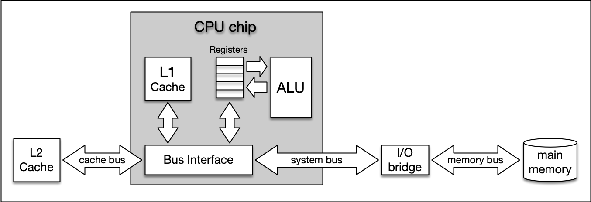

# 4. Memory Management
## 4.1. Debugging (`gdb`)
```
g++ -g main.cpp
```
Then
```
gdb a.out
```
[GDB cheat sheet](./GDB_Cheat_Sheet.pdf) gives you more detail about debugging using gdb.
[Source](https://darkdust.net/files/GDB%20Cheat%20Sheet.pdf)

## 4.2. Types of Computer Memory


## 4.3. Cache Memory
System architecture diagram showing caches, ALU (arithmetic logic unit), main memory, 
and the buses connected each component:



The concept of L1 and L2 (and even L3) cache is further illustrated by the following 
figure, which shows a multi-core CPU and its interplay with L1, L2 and L3 caches:


In the above figure:
* L1d and L1i represent memory space for data and instructions respectively.
* Size
  * L1: 16 to 64 kBytes
  * L2: at or below 2 megabytes
* **Level 3 Caches** is shared among all cores of a multicore processor. With the L3 cache, 
  the [cache coherence](https://en.wikipedia.org/wiki/Cache_coherence) protocol of multicore 
  processors can work much faster. This protocol compares the caches of all cores to maintain
  data consistency so that all processors have access to the same data at the same time. 
  The L3 cache therefore has less the function of a cache, but is intended to simplify and 
  accelerate the cache coherence protocol and the data exchange between the cores.

Command to know cache information on linux:
```
lscpu | grep cache
```

### 4.3.1. Temporal and Spatial Locality
* **Temporal Locality** means that address ranges that are accessed are likely to be used 
  again in the near future. In the course of time, the same memory address is accessed relatively 
  frequently (e.g. in a loop). This property can be used at all levels of the memory hierarchy to 
  keep memory areas accessible as quickly as possible.
* **Spatial Locality** means that after an access to an address range, the next access to an 
  address in the immediate vicinity is highly probable (e.g. in arrays). In the course of time, 
  memory addresses that are very close to each other are accessed again multiple times. This 
  can be exploited by moving the adjacent address areas upwards into the next hierarchy level 
  during a memory access.

## 4.4. Virtual Memory
### 4.4.1. Problems with Physical Mermory
* The idea of virtual memory stems back from a (not so long ago) time, when the random access 
  memory (RAM) of most computers was severely limited. Programers needed to treat memory as a 
  precious resource and use it most efficiently. Also, they wanted to be able to run programs 
  even if there was not enough RAM available.
* **Holes in address space**: If several programs are started one after the other and then 
  shortly afterwards some of these are terminated again, it must be ensured that the freed-up 
  space in between the remaining programs does not remain unused. If memory becomes too fragmented, 
  it might not be possible to allocate a large block of memory due to a large-enough free contiguous 
  block not being available any more.
* **Programs writing over each other**: If several programs are allowed to access the same memory 
  address, they will overwrite each others' data at this location. In some cases, this might even 
  lead to one program reading sensitive information (e.g. bank account info) that was written by 
  another program. This problem is of particular concern when writing concurrent programs which 
  run several threads at the same time.

The basic idea of virtual memory is to separate the addresses a program may use from the addresses 
in physical computer memory. By using a mapping function, an access to (virtual) program memory 
can be redirected to a real address which is guaranteed to be protected from other programs.


With virtual memory, the RAM acts as a cache for the virtual memory space which resides on 
secondary storage devices.

1) In a nutshell, virtual memory guarantees us a fixed-size address space which is largely independent 
of the system configuration. Also, 2) the **OS** guarantees that the virtual address spaces of different 
programs do not interfere with each other.

* A **memory page** is a number of directly successive memory locations in virtual memory defined by the 
  computer architecture and by the operating system. The computer memory is divided into memory pages of 
  equal size. The use of memory pages enables the operating system to perform virtual memory management. 
  The entire working memory is divided into tiles and each address in this computer architecture is interpreted 
  by the *Memory Management Unit (MMU)* as a logical address and converted into a physical address.
* A **memory frame** is mostly identical to the concept of a memory page with the key difference being 
  its location in the physical main memory instead of the virtual memory.


As can be seen, both processes have their own virtual memory space. Some of the pages are mapped to 
frames in the physical memory and some are not. If process 1 needs to use memory in the memory page 
that starts at address 0x1000, a page fault will occur if the required data is not there. The memory 
page will then be mapped to a vacant memory frame in physical memory. Also, note that the virtual 
memory addresses are not the same as the physical addresses. The first memory page of process 1, 
which starts at the virtual address 0x0000, is mapped to a memory frame that starts at the physical 
address 0x2000.

In summary, virtual memory management is performed by the operating system and programmers do usually 
not interfere with this process. The major benefit is a unique perspective on a chunk of memory for 
each program that is only limited in its size by the architecture of the system (32 bit, 64 bit) and 
by the available physical memory, including the hard disk.

## 4.5. The Process Memory Model
  
Each program is assigned its own virtual memory by the operating system. This address space is arranged 
in a linear fashion with one block of data being stored at each address. It is also divided into several 
distinct areas as illustrated by the figure below:


In a 32-bit computer, the address space has 32 bits and hence `2^32` entries, while in a 64-bit system,
the address space has 64 bits which is a very (close to unlimited!) memory space.

In the above figure, *Text* block contains the programs and instructions generated by compiler and linker. 
In addition the *OS Kernel Space* includes the kernel code which is controlled by OS.

* **Stack**
  * The stack is a contiguous memory block with a fixed maximum size.
  * If a program exceeds this size, it will crash.
  * The stack is used for storing automatically allocated variables such as local variables or function parameters.
  * If there are multiple threads in a program, then each thread has its own stack memory.
  * New memory on the stack is allocated when the path of execution enters a scope and freed again once the scope is left.
  * It is important to know that the stack is managed "automatically" by the compiler, which means we do not have 
    to concern ourselves with allocation and deallocation.
* **Heap**
  * The heap (also called "free store" in C++) is where data with dynamic storage lives. 
  * It is shared among multiple threads in a program, which means that memory management 
    for the heap needs to take concurrency into account. This makes memory allocations in 
    the heap more complicated than stack allocations.
  * In general, managing memory on the heap is more (computationally) expensive for the 
    operating system, which makes it slower than stack memory.
  * Contrary to the stack, the heap is not managed automatically by the system, but by the programmer.
  * If memory is allocated on the heap, it is the programmer’s responsibility to free it again when it 
    is no longer needed. If the programmer manages the heap poorly or not at all, there will be trouble.

* **The BSS (Block Started by Symbol)**
  * The BSS segment is used in many compilers and linkers for a segment that contains global and static 
    variables that are initialized with zero values.
  * This memory area is suitable, for example, for arrays that are **not initialized** with predefined values.

* **Data**
  * The data segment serves the same purpose as the BSS segment with the major difference being that 
    variables in the Data segment have been **initialized** with a value other than zero.
  * Memory for variables in the Data segment (and in BSS) is allocated once when a program is 
    run and persists throughout its lifetime.

## 4.6. Memory Allocation in C++
*Allocating* a memory space to a variable name means there is a memory space assigned to that variable. 
*Deallocating* means when the system has no longer any claim on that space by the variable name.

Generally, three types of memory allocation is supported:
1. **Static** memory allocation is performed for static and global variables, which are stored in 
  the BSS and Data segment. Memory for these types of variables is allocated once when your 
  program is run and persists throughout the life of your program.

2. **Automatic** memory allocation is performed for function parameters as well as local variables, 
  which are stored on the stack. Memory for these types of variables is allocated when the path 
  of execution enters a scope and freed again once the scope is left.

3. **Dynamic** memory allocation is a possibility for programs to request memory from the operating 
  system at runtime when needed. This is the major difference to automatic and static allocation, 
  where the size of the variable must be known at compile time. Dynamic memory allocation is not 
  performed on the limited stack but on the heap and is thus (almost) only limited by the size of 
  the address space.

## 4.7. Automatic Memory Allocation (The Stack)
The stack is the place in virtual memory where the local variables reside, including arguments to 
functions. Each time a function is called, the stack grows (from top to bottom) and each time a 
function returns, the stack contracts. When using multiple threads (as in concurrent programming), 
it is important to know that each thread has its own stack memory - which can be considered thread-safe.

1. The stack is a **contiguous block of memory**. It will not become fragmented (as opposed to the heap) 
  and it has a fixed maximum size.
2. When the **maximum size** of the stack memory is exceeded, a program will crash.
3. Allocating and deallocating memory is **fast** on the stack. It only involves moving the stack pointer 
  to a new position.

To check the stack size on linux machine run:
```
ulimit -s
```

## 4.8. Call by Reference vs. Call by Value
Drawbacks of passing by value:
1. Passing parameters by value means that a copy is created, which is an expensive operation that might 
  consume large amounts of memory, depending on the data that is being transferred. Later in we will 
  encounter "move semantics", which is an effective way to compensate for this downside.
2. Passing by value also means that the created copy can not be used as a back channel for communicating 
  with the caller, for example by directly writing the desired information into the variable.

We can create a back channel between caller and callee by a pointer. If a function gets a pointer as 
an argument, then by passing the address of a variable the function can modify the variable within 
the function. However, the first drawback still exist since the function creates a local variable 
containing the address of its argument. Example:

```cpp
#include <iostream>

void AddThree(int *val)
{
    *val += 3;
}

int main()
{
    int val = 0;
    AddThree(&val);
    val += 2;

    std::cout << "val = " << val << std::endl;
 
    return 0;
}
```

In contrast, in passing by reference the function receives a reference to the parameter, rather than 
a copy of its value. The function can now modify the argument such that the changes also happen on 
the caller side. Passing by reference is faster as no information needs to be copied and less stack 
memory required. Example:

```cpp
#include <iostream>

void AddFour(int &val)
{
    val += 4;
}

int main()
{
    int val = 0;
    AddFour(val);
    val += 2;

    std::cout << "val = " << val << std::endl;
 
    return 0;
}
```

### 4.8.1. Pointers vs. References
* Pointers can be declared without initialization. This means we can pass an uninitialized pointer 
  to a function who then internally performs the initialization for us.
* Pointers can be reassigned to another memory block on the heap.
* References are usually easier to use (depending on the expertise level of the programmer). 
  Sometimes however, if a third-party function is used without properly looking at the 
  parameter definition, it might go unnoticed that a value has been modified.

Example:

```cpp
#include <iostream>

void AddFour(int &val){   //pasing by reference
    val += 4;
}

void AddSix(int *val){    //passing by pointer
    *val += 6; 
}

int main(){
    int val = 0;
    AddFour(val);
    AddSix(&val);

    std::cout << "val = " << val << std::endl;
 
    return 0;
}
```

### 4.8.2. Three ways to pass a value to a function

```cpp
#include <stdio.h>
    
void CallByValue(int i){
    int j = 1; 
    printf ("call-by-value: %p\n",&j);
}

void CallByPointer(int *i){
    int j = 1; 
    printf ("call-by-pointer: %p\n",&j);
}

void CallByReference(int &i){
    int j = 1; 
    printf ("call-by-reference: %p\n",&j);
}

int main(){
    int i = 0;
    printf ("stack bottom: %p\n",&i); //as the bottom of stack address
    
    CallByValue(i);
    CallByPointer(&i);
    CallByReference(i);  //from here we cannot say whether it's pass by value or reference?!!

    return 0;
}
```

After running the above code, we expect the `CallByValue()` takes more space on the stack, 
however, it's not the case always. The reason is if the system is a 64-bit computer, the 
size of pointer is 8 bytes and the size of the value itself is 4 bytes. 

In order to benefit from call-by-reference, the size of the data type passed to the function 
has to surpass the size of the pointer on the respective architecture (i.e. 32 bit or 64 bit).

## 4.9. Heap Memory
* As opposed to local variables on the stack, memory can now be allocated in an arbitrary scope 
  (e.g. inside a function) without it being deleted when the scope is left. Thus, as long as the 
  address to an allocated block of memory is returned by a function, the caller can freely use it.

* Local variables on the stack are allocated at **compile-time**. Thus, the size of e.g. a string 
  variable might not be appropriate as the length of the string will not be known until the program 
  is executed and the user inputs it. With local variables, a solution would be to allocate a 
  long-enough array of and hope that the actual length does not exceed the buffer size. With dynamically 
  allocated heap memory, variables are allocated at **run-time**. This means that the size of the 
  above-mentioned string variable can be tailored to the actual length of the user input.

* Heap memory is only constrained by the size of the address space and by the available memory. With 
  modern 64 bit operating systems and large RAM memory and hard disks the programmer commands a vast 
  amount of memory. However, if the programmer forgets to deallocate a block of heap memory, it will 
  remain unused until the program is terminated. This is called a **memory leak**.

* Unlike the stack, the heap is **shared** among multiple **threads**, which means that memory management 
  for the heap needs to take concurrency into account as several threads might compete for the same 
  memory resource.

* When memory is allocated or deallocated on the stack, the stack pointer is simply shifted upwards or downwards. 
  Due to the sequential structure of stack memory management, stack memory can be managed (by the operating 
  system) easily and securely. With heap memory, allocation and deallocation can occur arbitrarily, depending 
  on the lifetime of the variables. This can result in **fragmented memory** over time, which is much more 
  difficult and expensive to manage.

### 4.9.1. Memory Fragmentation
A classic symptom of memory fragmentation is that you try to allocate a large block and you can’t, 
even though you appear to have enough memory free. On systems with virtual memory however, this 
is less of a problem, because large allocations only need to be contiguous in virtual address space, 
not in physical address space.

When memory is heavily fragmented however, memory allocations will likely take longer because the memory 
allocator has to do more work to find a suitable space for the new object.

## 4.10. Using `malloc` and `free`
To reserve memory on the heap, one of the two functions `malloc` (stands for *Memory Allocation*) or 
`calloc` (stands for *Cleared Memory Allocation*) is used. The header file `stdlib.h` or `malloc.h` 
must be included to use the functions.

Here is the syntax of malloc and calloc in C/C++:

```cpp
pointer_name = (cast-type*) malloc(size);
pointer_name = (cast-type*) calloc(num_elems, size_elem);
```

`malloc` is used to dynamically allocate a single large block of memory with the specified size. 
It returns a pointer of type void which can be cast into a pointer of any form.

`calloc` is used to dynamically allocate the specified number of blocks of memory of the specified 
type. It initializes each block with a default value '0'.

Both functions return a pointer of type void which can be cast into a pointer of any form. 
If the space for the allocation is insufficient, a NULL pointer is returned.

Example:
```cpp
struct MyStruct {
    int i; 
    double d; 
    char a[5];
};

MyStruct *p = (MyStruct*)calloc(4,sizeof(MyStruct));
p[0].i = 1; p[0].d = 3.14159; p[0].a[0] = 'a';
```

The size of the memory area reserved with `malloc` or `calloc` can be increased or decreased 
with the `realloc` function.

```cpp
pointer_name = (cast-type*) realloc( (cast-type*)old_memblock, new_size );
```

We can use `free` function to free the allocated memory on the heap using `malloc` or 
`calloc` as the following example:

```cpp
#include <stdio.h>
#include <stdlib.h>

int main()
{
    void *p = malloc(100); 
    free(p);

    return 0;
}
```

### 4.10.1. Dangling Pointer
In the following example, a pointer `p` is copied into a new variable `p2`, which is then passed to 
`free` AFTER the original pointer has been already released.

```
free(41143,0x1000a55c0) malloc: *** error for object 0x1003001f0: pointer being freed was not allocated.
```

In the workspace, you will see this error:

```
*** Error in './a.out': double free or corruption (fasttop): 0x0000000000755010 ***
```

```cpp
#include <stdio.h>
#include <stdlib.h>

int main()
{
    void *p = malloc(100); 
    void *p2 = p;
    
    free(p); // OK
    free(p2); // ERROR

    return 0;
}
```

The pointer `p2` in the example is invalid as soon as `free(p)` is called. It still holds the address 
to the memory location which has been freed, but may not access it anymore. Such a pointer is 
called a "**dangling pointer**".

Memory allocated with `malloc` or `calloc` is not subject to the familiar rules of variables in their 
respective scopes. This means that they exist independently of block limits until they are released again 
or the program is terminated. However, the pointers which refer to such heap-allocated memory are created 
on the stack and thus only exist within a limited scope. As soon as the scope is left, the pointer variable 
will be lost - but not the heap memory it refers to.
