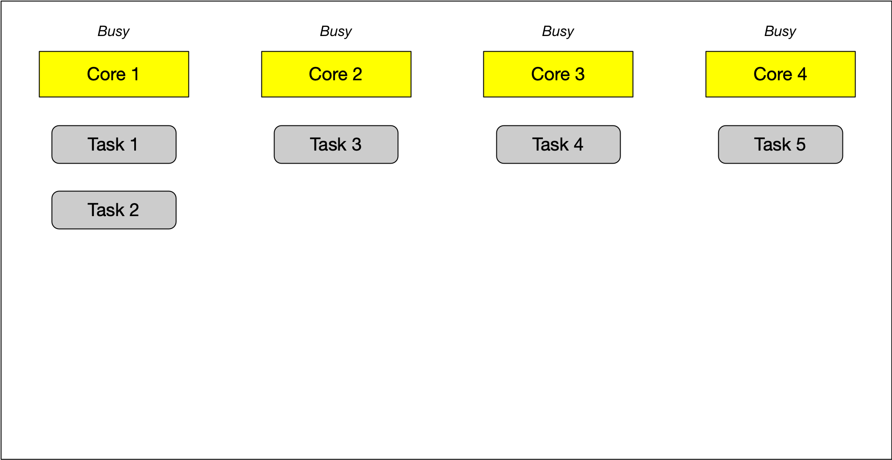

# 5. Concurrency
## 5.1. Processes and Threads
A **process** (also called a task) is a computer program at runtime. It is comprised of the runtime 
environment provided by the operating system (OS), as well as of the embedded binary code of the 
program during execution. A process is controlled by the OS through certain actions with which it 
sets the process into one of several carefully defined states:


* **Ready**: After its creation, a process enters the ready state and is loaded into main memory. The 
process now is ready to run and is waiting for CPU time to be executed. Processes that are ready for 
execution by the CPU are stored in a queue managed by the OS.
* **Running**: The operating system has selected the process for execution and the instructions within 
the process are executed on one or more of the available CPU cores.
* **Blocked**: A process that is blocked is one that is waiting for an event (such as a system resource 
becoming available) or the completion of an I/O operation.
* **Terminated**: When a process completes its execution or when it is being explicitly killed, it changes 
to the "terminated" state. The underlying program is no longer executing, but the process remains in the 
process table as a "zombie process". When it is finally removed from the process table, its lifetime ends.
* **Ready suspended**: A process that was initially in ready state but has been swapped out of main memory 
and placed onto external storage is said to be in suspend ready state. The process will transition back to 
ready state whenever it is moved to main memory again.
* **Blocked suspended**: A process that is blocked may also be swapped out of main memory. It may be swapped 
back in again under the same conditions as a "ready suspended" process. In such a case, the process will move 
to the blocked state, and may still be waiting for a resource to become available.

A **thread** represents a concurrent execution unit within a process. In contrast to full-blown processes 
as described above, threads are characterized as light-weight processes (LWP). These are significantly 
easier to create and destroy: In many systems the creation of a thread is up to 100 times faster than the 
creation of a process. This is especially advantageous in situations, when the need for concurrent operations 
changes dynamically.

A major *difference* between a process and a thread is that each process has its own address space, while a 
thread does not require a new address space to be created. All the threads in a process can access its shared 
memory. Threads also share other OS dependent resources such as processors, files, and network connections. As 
a result, the management overhead for threads is typically less than for processes. Threads, however, are not 
protected against each other and must carefully synchronize when accessing the shared process resources to 
avoid conflicts.

Similar to processes, threads exist in different states, which are illustrated in the figure below:


* **New**: A thread is in this state once it has been created. Until it is actually running, it will not 
take any CPU resources.
* **Runnable**: In this state, a thread might actually be running or it might be ready to run at any instant of 
time. It is the responsibility of the thread scheduler to assign CPU time to the thread.
* **Blocked**: A thread might be in this state, when it is waiting for I/O operations to complete. When 
blocked, a thread cannot continue its execution any further until it is moved to the runnable state again. 
It will not consume any CPU time in this state. The thread scheduler is responsible for reactivating the thread.

## 5.2. Running a Single Thread
A running program consists of at least one thread. When the main function is executed, we refer to it as the 
*main thread*. Threads are uniquely identified by their thread ID, which can be particularly useful for 
debugging a program. The following code prints the thread identifier of the main thread:

```cpp
#include <iostream>
#include <thread>

int main(){
    std::cout << "Hello concurrent world from main! Thread id = " << std::this_thread::get_id() << std::endl;

    return 0;
}
```

Also, it is possible to retrieve the number of available CPU cores of a system:

```cpp
#include <iostream>
#include <thread>

int main(){
    unsigned int nCores = std::thread::hardware_concurrency();
    std::cout << "This machine supports concurrency with " << nCores << " cores available" << std::endl;

    return 0;
}
```

### 5.2.1. Starting a second thread
In this section, we will start a second thread in addition to the main thread of our program. To do this, 
we need to construct a thread object and pass it the function we want to be executed by the thread. Once 
the thread enters the runnable state, the execution of the associated thread function may start at any 
point in time.

```cpp
// create thread
std::thread t(threadFunction);
```

After the thread object has been constructed, the main thread will continue and execute the remaining 
instructions until it reaches the end and returns. It is possible that by this point in time, the thread 
will also have finished. But if this is not the case, the main program will terminate and the resources of 
the associated process will be freed by the OS. As the thread exists within the process, it can no longer 
access those resources and thus not finish its execution as intended.

To prevent this from happening and have the main program wait for the thread to finish the execution of the 
thread function, we need to call `join()` on the thread object. This call will only return when the thread 
reaches the end of the thread function and block the main thread until then.

The following code shows how to use `join()` to ensure that `main()` waits for the thread `t` to finish 
its operations before returning. It uses the function `sleep_for()`, which pauses the execution of the 
respective threads for a specified amount of time. The idea is to simulate some work to be done in the 
respective threads of execution.

```cpp
#include <iostream>
#include <thread>

void threadFunction()
{
    std::this_thread::sleep_for(std::chrono::milliseconds(100)); // simulate work
    std::cout << "Finished work in thread\n"; 
}

int main()
{
    // create thread
    std::thread t(threadFunction);

    // do something in main()
    std::this_thread::sleep_for(std::chrono::milliseconds(50)); // simulate work
    std::cout << "Finished work in main\n";

    // wait for thread to finish
    t.join();

    return 0;
}
```

To compile this code with `g++`, you will need to use the `-pthread` flag. `pthread` adds support for 
multithreading with the pthreads library, and the option sets flags for both the preprocessor and linker:

```
g++ example_3.cpp -pthread
```

### 5.2.2. Randomness of events
The order of thread execution is up to OS scheduler and to the programmer it's random. In order to force 
the work flow to follow our desired flow, we can use `.join()` as a barrier when needed.

### 5.2.3. Detach
Let us now take a look at what happens if we don’t join a thread before its destructor is called. When we 
comment out join in the example above and then run the program again, it aborts with an error. The reason 
why this is done is that the designers of the C++ standard wanted to make debugging a multi-threaded program 
easier: Having the program crash forces the programmer to remember joining the threads that are created in a 
proper way. Such a hard error is usually much easier to detect than soft errors that do not show themselves 
so obviously.

There are some situations however, where it might make sense to not wait for a thread to finish its work. 
This can be achieved by *detaching* the thread, by which the internal state variable *joinable* is set to 
*false*. This works by calling the `detach()` method on the thread. The destructor of a detached thread 
does nothing: It neither blocks nor does it terminate the thread. In the following example, detach is called 
on the thread object, which causes the main thread to immediately continue until it reaches the end of the 
program code and returns. Note that a detached thread can not be joined ever again.

```cpp
#include <iostream>
#include <thread>

void threadFunction()
{
    std::this_thread::sleep_for(std::chrono::milliseconds(50)); // simulate work
    std::cout << "Finished work in thread\n"; 
}

int main()
{
    // create thread
    std::thread t(threadFunction);

    // detach thread and continue with main
    t.detach();

    // do something in main()
    std::this_thread::sleep_for(std::chrono::milliseconds(50)); // simulate work
    std::cout << "Finished work in main\n";

    return 0;
}
```

## 5.3. Starting a Thread with a Function Object
### 5.3.1. Functions and Callable Objects
In C++, callable objects are object that can appear as the left-hand operand of the 
call operator. These can be pointers to functions, objects of a class that defines an 
overloaded function call operator and lambdas (an anonymous inline function), with which 
function objects can be created in a very simple way. In the context of concurrency, we 
can use callable objects to attach a function to a thread.

### 5.3.2. Threads and Function Objects
The `std::thread` constructor can also be called with instances of classes that implement 
the function-call operator. In the following, we will thus define a class that has an 
overloaded ()-operator:

```cpp
#include <iostream>
#include <thread>

class Vehicle
{
public:
    void operator()()
    {
        std::cout << "Vehicle object has been created \n" << std::endl;
    }
};


int main()
{
    // create thread 
    std::thread t(Vehicle()); // C++'s most vexing parse

    // do something in main()
    std::cout << "Finished work in main \n";

    // wait for thread to finish
    t.join();

    return 0;
}
```

The above code generates the following error:

```
error: request for member ‘join’ in ‘t’, which is of non-class type ‘std::thread(Vehicle (*)())’
     t.join();
```

The expression was coined by Scott Meyers in 2001, who talks about it in details in his book 
"Effective STL". The *most vexing parse* comes from a rule in C++ that says that anything that 
could be considered as a function declaration, the compiler should parse it as a function declaration 
- even if it could be interpreted as something else.

In the previous code example, the line

```cpp
    // create thread 
    std::thread t(Vehicle());
```

is seemingly ambiguous, since it could be interpreted either as:

1. a variable definition for variable `t` of class `std::thread`, initialized with an anonymous 
instance of class `Vehicle` or
2. a function declaration for a function `t` that returns an object of type `std::thread` and has a single 
(unnamed) parameter that is a pointer to function returning an object of type `Vehicle`

Most programmers would presumable expect the first case to be true, but the C++ standard requires it to 
be interpreted as the second - hence the compiler warning.

There are three ways of forcing the compiler to consider the line as the first case, which would create 
the thread object we want:

1. Add an extra pair of parentheses
2. Use copy initialization
3. Use uniform initialization with braces

The following code shows all three variants:

```cpp
#include <iostream>
#include <thread>

class Vehicle
{
public:
    void operator()()
    {
        std::cout << "Vehicle object has been created \n" << std::endl;
    }
};


int main()
{
    // create thread 
    //std::thread t0(Vehicle()); // C++'s most vexing parse
    
    std::thread t1( (Vehicle()) ); // Add an extra pair of parantheses
    
    std::thread t2 = std::thread( Vehicle() ); // Use copy initialization
    
    std::thread t3{ Vehicle() };// Use uniform initialization with braces

    // do something in main()
    std::cout << "Finished work in main \n";

    // wait for thread to finish
    t1.join();
    t2.join();
    t3.join();

    return 0;
}
```

The output of this code sample shows that all three threads are executed and the `Vehicle` object 
is properly initialized.

Whichever option we use, the idea is the same: the function object is copied into internal storage 
accessible to the new thread, and the new thread invokes the operator `()`. The `Vehicle` class 
can of course have data members and other member functions too, and this is one way of passing data 
to the thread function: pass it in as a constructor argument and store it as a data member:

```cpp
#include <iostream>
#include <thread>

class Vehicle
{
public:
    Vehicle(int id) : _id(id) {}
    void operator()()
    {
        std::cout << "Vehicle #" << _id << " has been created" << std::endl;
    }

private:
    int _id;
};

int main()
{
    // create thread
    std::thread t = std::thread(Vehicle(1)); // Use copy initialization

    // do something in main()
    std::cout << "Finished work in main \n";

    // wait for thread to finish
    t.join();

    return 0;
}
```

### 5.3.3. Lambdas
Another very useful way of starting a thread and passing information to it is by using a lambda 
expression. With a Lambda you can easily create simple function objects.

A Lambda is often used as an argument for functions that can take a callable object. This can be 
easier than creating a named function that is used only when passed as an argument. In such cases, 
Lambdas are generally preferred because they allow the function objects to be defined inline. If 
Lambdas were not available, we would have to define an extra function somewhere else in our source 
file - which would work but at the expense of the clarity of the source code.

A Lambda is a function object (a "functor"), so it has a type and can be stored and passed around. 
Its result object is called a "closure", which can be called using the operator `()` as we will 
see shortly.

A lambda formally consists of three parts: 1. a capture list `[]` , 2. a parameter list `()` and 
3. a main part `{}`, which contains the code to be executed when the Lambda is called. Note that 
in principal all parts could be empty.

The *capture list `[]`*: By default, variables outside of the enclosing `{}` around the main part 
of the Lambda can not be accessed. By adding a variable to the capture list however, it becomes 
available within the Lambda either as a copy or as a reference. The captured variables become a 
part of the Lambda.

By default, variables in the capture block can not be modified within the Lambda. Using the keyword 
*mutable* allows to modify the parameters captured by copy, and to call their non-const member 
functions within the body of the Lambda. The following code examples show several ways of making the 
external variable "id" accessible within a Lambda:

```cpp
#include <iostream>

int main()
{
    // create lambdas
    int id = 0; // Define an integer variable

    //auto f0 = []() { std::cout << "ID = " << id << std::endl; }; // Error: 'id' cannot be accessed

    id++;
    auto f1 = [id]() { std::cout << "ID = " << id << std::endl; }; // OK, 'id' is captured by value

    id++;
    auto f2 = [&id]() { std::cout << "ID = " << id << std::endl; }; // OK, 'id' is captured by reference

    //auto f3 = [id]() { std::cout << "ID = " << ++id << std::endl; }; // Error, 'id' may not be modified

    auto f4 = [id]() mutable { std::cout << "ID = " << ++id << std::endl; }; // OK, 'id' may be modified

    // execute lambdas
    f1();
    f2();
    f4();

    return 0;
}
```

Even though we have been using Lambdas in the above example in various ways, it is important to note 
that a Lambda does not exist at runtime. The runtime effect of a Lambda is the generation of an object, 
which is known as *closure*. The difference between a Lambda and the corresponding closure is similar 
to the distinction between a class and an instance of the class. A class exists only in the source code 
while the objects created from it exist at runtime.

We can use (a copy of) the closure (i.e. f0, f1, …) to execute the code within the Lambda at a position 
in our program different to the line where the function object was created.

The *parameter list `()`*: The way parameters are passed to a Lambda is basically identical to calling 
a regular function. If the Lambda takes no arguments, these parentheses can be omitted (except when 
"mutable" is used). Example:

```cpp
#include <iostream>

int main()
{
    int id = 0; // Define an integer variable

    // create lambda
    auto f = [](const int id) { std::cout << "ID = " << id << std::endl; }; // ID is passed as a parameter

    // execute function object and pass the parameter
    f(id);

    return 0;
}
```

### 5.3.4. Starting Threads with Lambdas
A Lambda is, as we’ve seen, just an object and, like other objects it may be copied, passed as a 
parameter, stored in a container, etc. The Lambda object has its own scope and lifetime which may, 
in some circumstances, be different to those objects it has "captured". Programmers need to take 
special care when capturing local objects by reference because a Lambda’s lifetime may exceed the 
lifetime of its capture list: It must be ensured that the object to which the reference points is 
still in scope when the Lambda is called. This is especially important in multi-threading programs.

So let us start a thread and pass it a Lambda object to execute:

```cpp
#include <iostream>
#include <thread>

int main()
{
    int id = 0; // Define an integer variable

    // starting a first thread (by reference)
    auto f0 = [&id]() {
        std::this_thread::sleep_for(std::chrono::milliseconds(100));
        std::cout << "a) ID in Thread (call-by-reference) = " << id << std::endl;
    };
    std::thread t1(f0);

    // starting a second thread (by value)
    std::thread t2([id]() mutable {
        std::this_thread::sleep_for(std::chrono::milliseconds(50));
        std::cout << "b) ID in Thread (call-by-value) = " << id << std::endl;
    });

    // increment and print id in main
    ++id;
    std::cout << "c) ID in Main (call-by-value) = " << id << std::endl;

    // wait for threads before returning
    t1.join();
    t2.join();

    return 0;
}
```

The output of the program looks like this

```
c) ID in Main (call-by-value) = 1
b) ID in Thread (call-by-value) = 0
a) ID in Thread (call-by-reference) = 1
```

As you can see, the output in the main thread is generated first, at which point the variable ID 
has taken the value 1. Then, the call-by-value thread is executed with ID at a value of 0. Then, 
the call-by-reference thread is executed with ID at a value of 1. This illustrates the effect of 
passing a value by reference : when the data to which the reference refers changes before the thread 
is executed, those changes will be visible to the thread. We will see other examples of such behavior 
later in the course, as this is a primary source of concurrency bugs.

## 5.4. Starting a Thread with Variadic Templates and Member Functions
### 5.4.1. Passing Arguments using a Variadic Templates
In the previous section, we have seen that one way to pass arguments in to the thread function is to 
package them in a class using the function call operator. Even though this worked well, it would be 
very cumbersome to write a special class every time we need to pass data to a thread. We can also use 
a Lambda that captures the arguments and then calls the function. But there is a simpler way: The thread 
constructor may be called with a function and all its arguments. That is possible because the thread 
constructor is a variadic template that takes multiple arguments.

Before C++11, classes and functions could only accept a fixed number of arguments, which had to be 
specified during the first declaration. With variadic templates it is possible to include any number 
of arguments of any type.

```cpp
#include <iostream>
#include <thread>
#include <string>

void printID(int id)
{
    std::this_thread::sleep_for(std::chrono::milliseconds(50));
    std::cout << "ID = " << id << std::endl;
    
}

void printIDAndName(int id, std::string name)
{
    std::this_thread::sleep_for(std::chrono::milliseconds(100));
    std::cout << "ID = " << id << ", name = " << name << std::endl;
}

int main()
{
    int id = 0; // Define an integer variable

    // starting threads using variadic templates
    std::thread t1(printID, id);
    std::thread t2(printIDAndName, ++id, "MyString");
    std::thread t3(printIDAndName, ++id); // this procudes a compiler error

    // wait for threads before returning
    t1.join();
    t2.join();
    //t3.join();


    return 0;
}
```

There is one more difference between calling a function directly and passing it to a thread: With 
the former, arguments may be passed by value, by reference or by using move semantics - depending 
on the signature of the function. When calling a function using a variadic template, the arguments 
are by default either moved or copied - depending on whether they are rvalues or lvalues. There are 
ways however which allow us to overwrite this behavior. If you want to move an lvalue for example, 
we can call `std::move`. In the following example, two threads are started, each with a different 
string as a parameter. With `t1`, the string `name1` is copied by value, which allows us to print 
`name1` even after join has been called. The second string `name2` is passed to the thread function 
using move semantics, which means that it is not available any more after join has been called on `t2`.

```cpp
#include <iostream>
#include <thread>
#include <string>

void printName(std::string name, int waitTime)
{
    std::this_thread::sleep_for(std::chrono::milliseconds(waitTime));
    std::cout << "Name (from Thread) = " << name << std::endl;
}

int main()
{
    std::string name1 = "MyThread1";
    std::string name2 = "MyThread2";

    // starting threads using value-copy and move semantics 
    std::thread t1(printName, name1, 50);
    std::thread t2(printName, std::move(name2), 100);

    // wait for threads before returning
    t1.join();
    t2.join();

    // print name from main
    std::cout << "Name (from Main) = " << name1 << std::endl;
    std::cout << "Name (from Main) = " << name2 << std::endl;

    return 0;
}
```

The console output shows how using copy-by-value and `std::move` affect the string parameters:

```
Name (from Thread) = MyThread1
Name (from Thread) = MyThread2
Name (from Main) = MyThread1
Name (from Main) = 
```

In the following example, the signature of the thread function is modified to take a non-const 
reference to the string instead:

```cpp
#include <iostream>
#include <thread>
#include <string>

void printName(std::string &name, int waitTime)
{
    std::this_thread::sleep_for(std::chrono::milliseconds(waitTime));
    name += " (from Thread)";
    std::cout << name << std::endl;
}

int main()
{
    std::string name("MyThread");

    // starting thread
    std::thread t(printName, std::ref(name), 50);

    // wait for thread before returning
    t.join();

    // print name from main
    name += " (from Main)";
    std::cout << name << std::endl;

    return 0;
}
```

When passing the string variable `name` to the thread function, we need to explicitly mark it as a 
reference, so the compiler will treat it as such. This can be done by using the `std::ref` function. 
In the console output it becomes clear that the string has been successfully modified within the 
thread function before being passed to main.

```
MyThread (from Thread)
MyThread (from Thread) (from Main)
Process exited with code 0.
```

### 5.4.2. Starting Threads with Member Functions
In the previous sections, you have seen how to start threads with functions and function objects, 
with and without additional arguments. Also, you now know how to pass arguments to a thread function 
by reference. But what if we wish to run a member function other than the function call operator, such 
as a member function of an existing object? Luckily, the C++ library can handle this use-case: For 
calling member functions, the `std::thread` function requires an additional argument for the object 
on which to invoke the member function.

```cpp
#include <iostream>
#include <thread>

class Vehicle
{
public:
    Vehicle() : _id(0) {}
    void addID(int id) { _id = id; }
    void printID()
    {
        std::cout << "Vehicle ID=" << _id << std::endl;
    }

private:
    int _id;
};

int main()
{
    // create thread
    Vehicle v1, v2;
    std::thread t1 = std::thread(&Vehicle::addID, v1, 1); // call member function on object v
    std::thread t2 = std::thread(&Vehicle::addID, &v2, 2); // call member function on object v

    // wait for thread to finish
    t1.join();
    t2.join();

    // print Vehicle id
    v1.printID();
    v2.printID();

    return 0;
}
```

In the example above, the Vehicle object `v1` is passed to the thread function by value, thus a copy 
is made which does not affect the *original* living in the main thread. Changes to its member 
variable `_id` will thus not show when printing calling `printID()` later in main. The second 
Vehicle object `v2` is instead passed by reference. Therefore, changes to its `_id` variable will 
also be visible in the main thread - hence the following console output:

```
Vehicle ID=0
Vehicle ID=2
Process exited with code 0.
```

In the previous example, we have to ensure that the existence of `v2` outlives the completion of 
the thread `t2` - otherwise there will be an attempt to access an invalidated memory address. An 
alternative is to use a heap-allocated object and a reference-counted pointer such as 
`std::shared_ptr<Vehicle>` to ensure that the object lives as long as it takes the thread to finish 
its work. The following example shows how this can be implemented:

```cpp
#include <iostream>
#include <thread>

class Vehicle
{
public:
    Vehicle() : _id(0) {}
    void addID(int id) { _id = id; }
    void printID()
    {
        std::cout << "Vehicle ID=" << _id << std::endl;
    }

private:
    int _id;
};

int main()
{
    // create thread
    std::shared_ptr<Vehicle> v(new Vehicle);
    std::thread t = std::thread(&Vehicle::addID, v, 1); // call member function on object v
    
    // wait for thread to finish
    t.join();
    
    // print Vehicle id
    v->printID();
    
    return 0;
}
```

## 5.5. Running Multiple Threads
### 5.5.1. Fork-Join Parallelism
Using threads follows a basic concept called "fork-join-parallelism". The basic mechanism of 
this concept follows a simple three-step pattern:

1. Split the flow of execution into a parallel thread ("fork")
2. Perform some work in both the main thread and the parallel thread
3. Wait for the parallel thread to finish and unite the split flow of execution again ("join")

The following diagram illustrates the basic idea of forking:


In the following example, a number of threads is created and added to a vector. The basic idea 
is to loop over the vector at the end of the main function and call join on all the thread objects 
inside the vector.

```cpp
#include <iostream>
#include <thread>
#include <vector>

void printHello()
{
    // perform work
    std::cout << "Hello from Worker thread #" << std::this_thread::get_id() << std::endl;
}

int main()
{
    // create threads
    std::vector<std::thread> threads;
    for (size_t i = 0; i < 5; ++i)
    {
        // copying thread objects causes a compile error
        /*
        std::thread t(printHello);
        threads.push_back(t); 
        */

        // moving thread objects will work
        threads.emplace_back(std::thread(printHello));
    }

    // do something in main()
    std::cout << "Hello from Main thread #" << std::this_thread::get_id() << std::endl;

    // call join on all thread objects using a range-based loop
    for (auto &t : threads)
        t.join();

    return 0;
}
```

When we try to compile the program using the `push_back()` function (which is the usual way 
in most cases), we get a compiler error. The problem with our code is that by pushing the 
thread object into the vector, we attempt to make a copy of it. However, thread objects do not 
have a copy constructor and thus can not be duplicated. If this were possible, we would create 
yet another branch in the flow of execution - which is not what we want. The solution to this problem 
is to use move semantics, which provide a convenient way for the contents of objects to be 'moved' 
between objects, rather than copied.

To solve our problem, we can use the function `emplace_back()` instead of `push_back()`, which internally 
uses move semantics to move our thread object into the vector without making a copy. When executing the 
code, we get the following output:

```
Hello from Worker thread #Hello from Worker thread #140370329347840140370337740544
Hello from Worker thread #140370320955136
Hello from Worker thread #140370346133248

Hello from Main thread #140370363660096
Hello from Worker thread #140370312562432
```

## 5.6. Passing Data Between Threads
### 5.6.1. Promises and Futures
In the previous sections, we've seen the data transfer between the main (parent) and child
thread. These methods can pass data to the child thread only when we create them. But how we
pass data from child to parent thread?

In order to achieve this, the threads need to adhere to a strict synchronization protocol. 
There is a such a mechanism available in the C++ standard that we can use for this purpose. 
This mechanism acts as a single-use channel between the threads. The sending end of the 
channel is called "promise" while the receiving end is called "future".

In the C++ standard, the class template `std::promise` provides a convenient way to store a 
value or an exception that will acquired asynchronously at a later time via a `std::future` 
object. Each `std::promise` object is meant to be used only a single time.

In the following example, we want to declare a promise which allows for transmitting a string 
between two threads and modifying it in the process.

```cpp
#include <iostream>
#include <thread>
#include <future>

void modifyMessage(std::promise<std::string> && prms, std::string message)
{
    std::this_thread::sleep_for(std::chrono::milliseconds(4000)); // simulate work
    std::string modifiedMessage = message + " has been modified"; 
    prms.set_value(modifiedMessage);
}

int main()
{
    // define message
    std::string messageToThread = "My Message";

    // create promise and future
    std::promise<std::string> prms;
    std::future<std::string> ftr = prms.get_future();

    // start thread and pass promise as argument
    std::thread t(modifyMessage, std::move(prms), messageToThread);

    // print original message to console
    std::cout << "Original message from main(): " << messageToThread << std::endl;

    // retrieve modified message via future and print to console
    std::string messageFromThread = ftr.get();
    std::cout << "Modified message from thread(): " << messageFromThread << std::endl;

    // thread barrier
    t.join();

    return 0;
}
```

After defining a message, we have to create a suitable promise that can take a string object. 
To obtain the corresponding future, we need to call the method `get_future()` on the promise. 
Promise and future are the two types of the communication channel we want to use to pass a 
string between threads. The communication channel set up in this manner can only pass a string.

We can now create a thread that takes a function and we will pass it the promise as an argument 
as well as the message to be modified. Promises can not be copied, because the promise-future 
concept is a two-point communication channel for one-time use. Therefore, we must pass the promise 
to the thread function using `std::move`. The thread will then, during its execution, use the promise 
to pass back the modified message.

The thread function takes the promise as an `rvalue` reference in accordance with move semantics. 
After waiting for several seconds, the message is modified and the method `set_value()` is called 
on the promise.

Back in the main thread, after starting the thread, the original message is printed to the console. 
Then, we start listening on the other end of the communication channel by calling the function `get()` on 
the future. This method will block until data is available - which happens as soon as `set_value` has been 
called on the promise (from the thread). If the result is movable (which is the case for `std::string`), 
it will be moved - otherwise it will be copied instead. After the data has been received (with a considerable 
delay), the modified message is printed to the console.

It is also possible that the worker value calls `set_value` on the promise before `get()` is called on the 
future. In this case, `get()` returns immediately without any delay. After `get()` has been called once, the 
future is no longer usable. This makes sense as the normal mode of data exchange between promise and future 
works with `std::move` - and in this case, the data is no longer available in the channel after the first call 
to `get()`. If `get()` is called a second time, an exception is thrown.

#### 5.6.1.1. `get()` vs. `wait()`
There are some situations where it might be interesting to separate the waiting for the content from the 
actual retrieving. Futures allow us to do that using the `wait()` function. This method will block until 
the future is ready. Once it returns, it is guaranteed that data is available and we can use `get()` to 
retrieve it without delay.

In addition to wait, the C++ standard also offers the method `wait_for`, which takes a time duration as an 
input and also waits for a result to become available. The method `wait_for()` will block either until 
the specified timeout duration has elapsed or the result becomes available - whichever comes first. 
The return value identifies the state of the result.

The following example uses the `wait_for` method to wait for the availability of a result for one second. 
After the time has passed (or the result is available), it prints the result to the console. Should the 
time be up without the result being available, print an error message to the console instead.

```cpp
#include <iostream>
#include <thread>
#include <future>
#include <cmath>

void computeSqrt(std::promise<double> &&prms, double input)
{
    std::this_thread::sleep_for(std::chrono::milliseconds(2000)); // simulate work
    double output = sqrt(input);
    prms.set_value(output);
}

int main()
{
    // define input data
    double inputData = 42.0;

    // create promise and future
    std::promise<double> prms;
    std::future<double> ftr = prms.get_future();

    // start thread and pass promise as argument
    std::thread t(computeSqrt, std::move(prms), inputData);

// Student task STARTS here
    // wait for result to become available
    auto status = ftr.wait_for(std::chrono::milliseconds(2001));
    if (status == std::future_status::ready) // result is ready
    {
        std::cout << "Result = " << ftr.get() << std::endl;
    }

    //  timeout has expired or function has not yet been started
    else if (status == std::future_status::timeout || status == std::future_status::deferred)
    {
        std::cout << "Result unavailable" << std::endl;
    }
// Student task ENDS here    

    // thread barrier
    t.join();

    return 0;
}
```

#### 5.6.1.2. Passing Exception
The future-promise communication channel may also be used for passing exceptions. To do this, the 
worker thread simply sets an exception rather than a value in the promise. In the parent thread, 
the exception is then re-thrown once `get()` is called on the future.

Let us take a look at the following example to see how this mechanism works:

```cpp
#include <iostream>
#include <thread>
#include <future>
#include <cmath>
#include <memory>

void divideByNumber(std::promise<double> &&prms, double num, double denom)
{
    std::this_thread::sleep_for(std::chrono::milliseconds(500)); // simulate work
    try
    {
        if (denom == 0)
            throw std::runtime_error("Exception from thread: Division by zero!");
        else
            prms.set_value(num / denom);
    }
    catch (...)
    {
        prms.set_exception(std::current_exception());
    }
}

int main()
{
    // create promise and future
    std::promise<double> prms;
    std::future<double> ftr = prms.get_future();

    // start thread and pass promise as argument
    double num = 42.0, denom = 0.0;
    std::thread t(divideByNumber, std::move(prms), num, denom);

    // retrieve result within try-catch-block
    try
    {
        double result = ftr.get();
        std::cout << "Result = " << result << std::endl;
    }
    catch (std::runtime_error e)
    {
        std::cout << e.what() << std::endl;
    }

    // thread barrier
    t.join();

    return 0;
}
```

In the thread function, we need to implement a try-catch block which can be set to catch 
a particular exception or - as in our case - to catch all exceptions. Instead of setting 
a value, we now want to throw a `std::exception` along with a customized error message. 
In the catch-block, we catch this exception and throw it to the parent thread using the 
promise with `set_exception`. The function `std::current_exception` allows us to easily 
retrieve the exception which has been thrown.

On the parent side, we now need to catch this exception. In order to do this, we can use 
a try-block around the call to `get()`. We can set the catch-block to catch all exceptions 
or - as in this example - we could also catch a particular one such as the standard exception. 
Calling the method `what()` on the exception allows us to retrieve the message from the 
exception - which is the one defined on the promise side of the communication channel.

When we run the program, we can see that the exception is being thrown in the worker thread 
with the main thread printing the corresponding error message to the console.

So a promise future pair can be used to pass either values or exceptions between threads. 
The disadvantages of promis and future pair are 1) they can be used only once, 2) the direction 
of passing data is only one way which is from the worker thread to the parent thread.

### 5.6.2. Threads vs. Tasks
#### 5.6.2.1. Starting threads with async
For the straight-forward task of returning data or exceptions from a worker thread to the 
parent thread however, there is a simpler and more convenient way using `std::async()` 
instead of `std::thread()`.

Let us adapt the code example from the last section to use `std::async`:

```cpp
#include <iostream>
#include <thread>
#include <future>
#include <cmath>
#include <memory>

double divideByNumber(double num, double denom)
{
    std::this_thread::sleep_for(std::chrono::milliseconds(500)); // simulate work

    if (denom == 0)
        throw std::runtime_error("Exception from thread: Division by zero!");

    return num / denom;
}


int main()
{
    // use async to start a task
    double num = 42.0, denom = 2.0;
    std::future<double> ftr = std::async(divideByNumber, num, denom);

    // retrieve result within try-catch-block
    try
    {
        double result = ftr.get();
        std::cout << "Result = " << result << std::endl;
    }
    catch (std::runtime_error e)
    {
        std::cout << e.what() << std::endl;
    }

    return 0;
}
```

The first change we are making is in the thread function: We are removing the promise from 
the argument list as well as the try-catch block. Also, the return type of the function is 
changed from void to double as the result of the computation will be channeled back to the 
main thread using a simple return. After these changes, the function has no knowledge of 
threads, nor of futures or promises - it is a simple function that takes two doubles as arguments 
and returns a double as a result. Also, it will throw an exception when a division by zero is attempted.

In the main thread, we need to replace the call to `std::thread` with `std::async`. Note that async 
returns a future, which we will use later in the code to retrieve the value that is returned by the 
function. A promise, as with `std::thread`, is no longer needed, so the code becomes much shorter. 
In the try-catch block, nothing has changed - we are still calling `get()` on the future in the 
try-block and exception-handling happens unaltered in the catch-block. Also, we do not need to call 
`join()` any more. With async, the thread destructor will be called automatically - which reduces the 
risk of a concurrency bug.

When we execute the code in the previous example, the output is identical to before, so we seemingly 
have the same functionality as before - or do we? When we use the `std::this_thread::get_id()` to print 
the system thread ids of the main and of the worker thread, we get the following command line output:

```
Main thread id = 0x1000c15c0
Worker thread id = 0x7000056df000
```

As expected, the ids between the two threads differ from each other - they are running in parallel. 
However, one of the major differences between `std::thread` and `std::async` is that with the latter, 
the system decides whether the associated function should be run asynchronously or synchronously. By 
adjusting the launch parameters of `std::async manually`, we can directly influence whether the associated 
thread function will be executed synchronously or asynchronously.

The line

```cpp
std::future<double> ftr = std::async(std::launch::deferred, divideByNumber, num, denom);
```

enforces the synchronous execution of divideByNumber, which results in the following output, where the 
thread ids for main and worker thread are identical.

```
Main thread id = 0x1000c15c0
Worker thread id = 0x1000c15c0
```

If we were to use the launch option "async" instead of "deferred", we would enforce an asynchronous execution 
whereas the option "any" would leave it to the system to decide - which is the default.

At this point, let us compare `std::thread` with `std::async`: Internally, `std::async` creates a promise, 
gets a future from it and runs a template function that takes the promise, calls our function and then 
either sets the value or the exception of that promise - depending on function behavior. The code used 
internally by `std::async` is more or less identical to the code we used in the previous example, except 
that this time it has been generated by the compiler and it is hidden from us - which means that the code 
we write appears much cleaner and leaner. Also, `std::async` makes it possible to control the amount of 
concurrency by passing an optional launch parameter, which enforces either synchronous or asynchronous behavior. 
This ability, especially when left to the system, allows us to prevent an overload of threads, which would 
eventually slow down the system as threads consume resources for both management and communication. If we were 
to use too many threads, the increased resource consumption would outweigh the advantages of parallelism and slow 
down the program. By leaving the decision to the system, we can ensure that the number of threads is chosen in a 
carefully balanced way that optimizes runtime performance by looking at the current workload of the system and the 
multi-core architecture of the system.

#### 5.6.2.2. Task-based concurrency
Determining the optimal number of threads to use is a hard problem. It usually depends on the number of 
available cores whether it makes sense to execute code as a thread or in a sequential manner. The use of 
`std::async` (and thus tasks) take the burden of this decision away from the user and let the system decide 
whether to execute the code sequentially or as a thread. With tasks, the programmer decides what CAN be run 
in parallel in principle and the system then decides at runtime what WILL be run in parallel.

Internally, this is achieved by using thread-pools which represent the number of available threads based on 
the cores/processors as well as by using work-stealing queues, where tasks are re-distributed among the available 
processors dynamically. The following diagram shows the principal of task distribution on a multi-core system using 
work stealing queues.


As can be seen, the first core in the example is heavily oversubscribed with several tasks that are waiting to be 
executed. The other cores however are running idle. The idea of a work-stealing queue is to have a watchdog program 
running in the background that regularly monitors the amount of work performed by each processor and redistributes it 
as needed. For the above example this would mean that tasks waiting for execution on the first core would be shifted 
(or "stolen") from busy cores and added to available free cores such that idle time is reduced. After this rearranging 
procedure, the task distribution in our example could look as shown in the following diagram.



A work distribution in this manner can only work, when parallelism is explicitly described in the program by the 
programmer. If this is not the case, work-stealing will not perform effectively.

To conclude this section, a general **comparison** of task-based and thread-based programming is given in the following:

With tasks, the system takes care of many details (e.g. join). With threads, the programmer is responsible for many 
details. As far as resources go, threads are usually more heavy-weight as they are generated by the operating system 
(OS). It takes time for the OS to be called and to allocate memory / stack / kernel data structures for the thread. 
Also, destroying the thread is expensive. Tasks on the other hand are more light-weight as they will be using a pool 
of already created threads (the "thread pool").

Threads and tasks are used for different problems. Threads have more to do with latency. When you have functions that 
can block (e.g. file input, server connection), threads can avoid the program to be blocked, when e.g. the server is 
waiting for a response. Tasks on the other hand focus on throughput, where many operations are executed in parallel.

In this section, we want to explore the influence of the number of threads on the performance of a program with 
respect to its overall runtime. The example below has a thread function called "workerThread" which contains a loop 
with an adjustable number of cycles in which a mathematical operation is performed.

```cpp
#include <iostream>
#include <thread>
#include <future>
#include <cmath>
#include <vector>
#include <chrono>

void workerFunction(int n)
{
    // print system id of worker thread
    std::cout << "Worker thread id = " << std::this_thread::get_id() << std::endl;

    // perform work
    for (int i = 0; i < n; ++i)
    {
        sqrt(12345.6789);
    }
}

int main()
{
    // print system id of worker thread
    std::cout << "Main thread id = " << std::this_thread::get_id() << std::endl;

    // start time measurement
    std::chrono::high_resolution_clock::time_point t1 = std::chrono::high_resolution_clock::now();
    
    // launch various tasks
    std::vector<std::future<void>> futures;
    int nLoops = 10, nThreads = 5;
    for (int i = 0; i < nThreads; ++i)
    {
        futures.emplace_back(std::async(std::launch::any, workerFunction, nLoops));
    }

    // wait for tasks to complete
    for (const std::future<void> &ftr : futures)
        ftr.wait();

    // stop time measurement and print execution time
    std::chrono::high_resolution_clock::time_point t2 = std::chrono::high_resolution_clock::now();
    auto duration = std::chrono::duration_cast<std::chrono::microseconds>( t2 - t1 ).count();
    std::cout << "Execution finished after " << duration <<" microseconds" << std::endl;
    
    return 0;
}
```
### 5.6.3. Avoiding Data Races
#### 5.6.3.1. Understanding data races
One of the primary sources of error in concurrent programming are data races. They occur, when two 
concurrent threads are accessing the same memory location while at least one of them is modifying 
(the other thread might be reading or modifying). In this scenario, the value at the memory location 
is completely undefined. Depending on the system scheduler, the second thread will be executed at an 
unknown point in time and thus see different data at the memory location with each execution. Depending 
on the type of program, the result might be anything from a crash to a security breach when data is 
read by a thread that was not meant to be read, such as a user password or other sensitive information. 
Such an error is called a „data race“ because two threads are racing to get access to a memory location 
first, with the content at the memory location depending on the result of the race.

One safe way of passing data to a thread would be to carefully synchronize the two threads using either 
`join()` or the promise-future concept that can guarantee the availability of a result. Data races are 
always to be avoided. Even if nothing bad seems to happen, they are a bug and should always be treated 
as such. Another possible solution for the above example would be to make a copy of the original argument 
and pass the copy to the thread, thereby preventing the data race.

#### 5.6.3.2. Passing data to a thread by value
In the following example, an instance of the proprietary class `Vehicle` is created and passed to a thread 
by value, thus making a copy of it.

```cpp
#include <iostream>
#include <thread>
#include <future>

class Vehicle
{
public:
    //default constructor
    Vehicle() : _id(0)
    {
        std::cout << "Vehicle #" << _id << " Default constructor called" << std::endl;
    }

    //initializing constructor
    Vehicle(int id) : _id(id)
    {
        std::cout << "Vehicle #" << _id << " Initializing constructor called" << std::endl;
    }

    // setter and getter
    void setID(int id) { _id = id; }
    int getID() { return _id; }

private:
    int _id;
};

int main()
{
    // create instances of class Vehicle
    Vehicle v0; // default constructor
    Vehicle v1(1); // initializing constructor

    // read and write name in different threads (which one of the above creates a data race?)
    std::future<void> ftr = std::async([](Vehicle v) {
        std::this_thread::sleep_for(std::chrono::milliseconds(500)); // simulate work
        v.setID(2);
    }, v0);

    v0.setID(3);

    ftr.wait();
    std::cout << "Vehicle #" << v0.getID() << std::endl;

    return 0;
}
```

In this program, the output will always be the following:

```
Vehicle #0 Default constructor called
Vehicle #1 Initializing constructor called
Vehicle #3
```

Passing data to a thread in this way is a clean and safe method as there is no danger of a 
data race - at least when atomic data types such as integers, doubles, chars or booleans 
are passed.

When passing a complex data structure however, there are sometimes pointer variables hidden 
within, that point to a (potentially) shared data buffer - which might cause a data race even 
though the programmer believes that the copied data will effectively preempt this. The next 
example illustrates this case by adding a new member variable to the Vehicle class, which is 
a pointer to a string object, as well as the corresponding getter and setter functions.

```cpp
#include <iostream>
#include <thread>
#include <future>

class Vehicle
{
public:
    //default constructor
    Vehicle() : _id(0), _name(new std::string("Default Name"))
    {
        std::cout << "Vehicle #" << _id << " Default constructor called" << std::endl;
    }

    //initializing constructor
    Vehicle(int id, std::string name) : _id(id), _name(new std::string(name))
    {
        std::cout << "Vehicle #" << _id << " Initializing constructor called" << std::endl;
    }

    // setter and getter
    void setID(int id) { _id = id; }
    int getID() { return _id; }
    void setName(std::string name) { *_name = name; }
    std::string getName() { return *_name; }

private:
    int _id;
    std::string *_name;
};

int main()
{
    // create instances of class Vehicle
    Vehicle v0;    // default constructor
    Vehicle v1(1, "Vehicle 1"); // initializing constructor

    // launch a thread that modifies the Vehicle name
    std::future<void> ftr = std::async([](Vehicle v) {
        std::this_thread::sleep_for(std::chrono::milliseconds(500)); // simulate work
        v.setName("Vehicle 2");
    },v0);

    v0.setName("Vehicle 3");

    ftr.wait();
    std::cout << v0.getName() << std::endl;

    return 0;
}
```

The output of the program looks like this:

```
Vehicle #0 Default constructor called
Vehicle #1 Initializing constructor called
Vehicle 2
```

The basic program structure is mostly identical to the previous example with the object `v0 
being copied by value when passed to the thread function. This time however, even though a 
copy has been made, the original object `v0` is modified, when the thread function sets the 
new name. This happens because the member `_name` is a pointer to a string and after copying, 
even though the pointer variable has been duplicated, it still points to the same location as 
its value (i.e. the memory location) has not changed. Note that when the delay is removed in 
the thread function, the console output varies between "Vehicle 2" and "Vehicle 3", depending 
on the system scheduler. Such an error might go unnoticed for a long time. It could show itself 
well after a program has been shipped to the client - which is what makes this error type so 
treacherous.

Classes from the standard template library usually implement a deep copy behavior by default 
(such as `std::vector`). When dealing with proprietary data types, this is not guaranteed. 
The only safe way to tell whether a data structure can be safely passed is by looking at its 
implementation: Does it contain only atomic data types or are there pointers somewhere? If this 
is the case, does the data structure implement the copy constructor (and the assignment operator) 
correctly? Also, if the data structure under scrutiny contains sub-objects, their respective implementation 
has to be analyzed as well to ensure that deep copies are made everywhere.

Unfortunately, one of the primary concepts of object-oriented programming - information hiding - often 
prevents us from looking at the implementation details of a class - we can only see the interface, 
which does not tell us what we need to know to make sure that an object of the class may be safely 
passed by value.

#### 5.6.3.3. Overwriting the copy constructor
The problem with passing a proprietary class is that the standard copy constructor makes a 1:1 copy of 
all data members, including pointers to objects. This behavior is also referred to as "shallow copy". In 
the above example we would have liked (and maybe expected) a "deep copy" of the object though, i.e. a copy 
of the data to which the pointer refers. A solution to this problem is to create a proprietary copy constructor 
in the class Vehicle. The following piece of code overwrites the default copy constructor and can be modified 
to make a customized copy of the data members.

```cpp
// copy constructor 
Vehicle(Vehicle const &src)
{
	_id = src._id;
	if (src._name != nullptr)
	{
		_name = new std::string;
		*_name = *src._name;
	}
	std::cout << "Vehicle #" << _id << " copy constructor called" << std::endl;
};

```

#### 5.6.3.4. Passing data using move semantics
Even though a customized copy constructor can help us to avoid data races, it is also time (and memory) consuming. 
In the following, we will use move semantics to implement a more effective way of safely passing data to a thread.

A move constructor enables the resources owned by an rvalue object to be moved into an lvalue without physically 
copying it. Rvalue references support the implementation of move semantics, which enables the programmer to write 
code that transfers resources (such as dynamically allocated memory) from one object to another.

To make use of move semantics, we need to provide a move constructor (and optionally a move assignment operator). 
Copy and assignment operations whose sources are rvalues automatically take advantage of move semantics. Unlike 
the default copy constructor however, the compiler does not provide a default move constructor.

To define a move constructor for a C++ class, the following steps are required:
1. Define an empty constructor method that takes an rvalue reference to the class type as its parameter

```cpp
// move constructor 
Vehicle(Vehicle && src)
{
	//...
	std::cout << "Vehicle #" << _id << " move constructor called" << std::endl;
};
```

2. In the move constructor, assign the class data members from the source object to the object that is being 
constructed

```cpp
 _id = src.getID();
_name = new std::string(src.getName());
```

3. Assign the data members of the source object to default values.

```cpp
src.setID(0);
src.setName("Default Name");
```

When launching the thread, the Vehicle object `v0` can be passed using `std::move()` - which calls the move constructor 
and invalidates the original object `v0` in the main thread.

```cpp
#include <iostream>
#include <thread>
#include <future>

class Vehicle
{
public:
    //default constructor
    Vehicle() : _id(0), _name(new std::string("Default Name"))
    {
        std::cout << "Vehicle #" << _id << " Default constructor called" << std::endl;
    }

    //initializing constructor
    Vehicle(int id, std::string name) : _id(id), _name(new std::string(name))
    {
        std::cout << "Vehicle #" << _id << " Initializing constructor called" << std::endl;
    }

    // copy constructor 
    Vehicle(Vehicle const &src)
    {
        //...
        std::cout << "Vehicle #" << _id << " copy constructor called" << std::endl;
    };

    // move constructor 
    Vehicle(Vehicle && src)
    {
        _id = src.getID();
        _name = new std::string(src.getName());

        src.setID(0);
        src.setName("Default Name");

        std::cout << "Vehicle #" << _id << " move constructor called" << std::endl;
    };

    // setter and getter
    void setID(int id) { _id = id; }
    int getID() { return _id; }
    void setName(std::string name) { *_name = name; }
    std::string getName() { return *_name; }

private:
    int _id;
    std::string *_name;
};

int main()
{
    // create instances of class Vehicle
    Vehicle v0;    // default constructor
    Vehicle v1(1, "Vehicle 1"); // initializing constructor

    // launch a thread that modifies the Vehicle name
    std::future<void> ftr = std::async([](Vehicle v) {
        v.setName("Vehicle 2");
    },std::move(v0));

    ftr.wait();
    std::cout << v0.getName() << std::endl;

    return 0;
}
```

#### 5.6.3.5. Move semantics and uniqueness
With move semantics , we can additionally use the notion of uniqueness to prevent data races by 
default. In the following example, a `unique_pointer` instead of a raw pointer is used for the 
string member in the Vehicle class.

```cpp
#include <iostream>
#include <thread>
#include <future>
#include <memory>

class Vehicle
{
public:
    //default constructor
    Vehicle() : _id(0), _name(new std::string("Default Name"))
    {
        std::cout << "Vehicle #" << _id << " Default constructor called" << std::endl;
    }

    //initializing constructor
    Vehicle(int id, std::string name) : _id(id), _name(new std::string(name))
    {
        std::cout << "Vehicle #" << _id << " Initializing constructor called" << std::endl;
    }

    // move constructor with unique pointer
    Vehicle(Vehicle && src) : _name(std::move(src._name))
    {
        // move id to this and reset id in source
        _id = src.getID();
        src.setID(0);

        std::cout << "Vehicle #" << _id << " move constructor called" << std::endl;
    };

    // setter and getter
    void setID(int id) { _id = id; }
    int getID() { return _id; }
    void setName(std::string name) { *_name = name; }
    std::string getName() { return *_name; }

private:
    int _id;
    std::unique_ptr<std::string> _name;
};


int main()
{
    // create instances of class Vehicle
    Vehicle v0;    // default constructor
    Vehicle v1(1, "Vehicle 1"); // initializing constructor

    // launch a thread that modifies the Vehicle name
    std::future<void> ftr = std::async([](Vehicle v) {
        v.setName("Vehicle 2");
    },std::move(v0));

    ftr.wait();
    std::cout << v0.getName() << std::endl; // this will now cause an exception

    return 0;
}
```

As can be seen, the `std::string` has now been changed to a unique pointer, which means that only a single 
reference to the memory location it points to is allowed. Accordingly, the move constructor transfers the 
unique pointer to the worker by using `std::move` and thus invalidates the pointer in the main thread. When 
calling `v0.getName()`, an exception is thrown, making it clear to the programmer that accessing the data at 
this point is not permissible - which is the whole point of using a unique pointer here as a data race will 
now be effectively prevented.

The point of this example has been to illustrate that move semantics on its own is not enough to avoid data 
races. The key to thread safety is to use move semantics in conjunction with uniqueness. It is the responsibility 
of the programmer to ensure that pointers to objects that are moved between threads are unique.

## 5.7. Mutexes and Locks
### 5.7.1. Using a Mutex to Protect Shared Data
#### 5.7.1.1. The mutex entity
Until now, the methods we have used to pass data between threads were short-term and involved passing an 
argument (the promise) from a parent thread to a worker thread and then passing a result back to the 
parent thread (via the future) once it has become available. The promise-future construct is a non-permanent 
communication channel for one-time usage.

We have seen that in order to avoid data races, we need to either forego accessing shared data or use it in 
read-only access without mutating the data. In this chapter, we want to look at a way to establish a stable 
long-term communication channel that allows for both sharing and mutation. Ideally, we would like to have a 
communication protocol that corresponds to voice communication over a radio channel, where the transmitter 
uses the expression "over" to indicate the end of the transmission to the receiver. By using such a protocol, 
sender and receiver can take turns in transmitting their data. In C++, this concept of taking turns can be 
constructed by an entity called a "mutex" - which stands for MUtual EXclusion.

Recall that a data race requires simultaneous access from two threads. If we can guarantee that only a single 
thread at a time can access a particular memory location, data races would not occur. In order for this to work, 
we would need to establish a communication protocol. It is important to note that a mutex is not the solution to 
the data race problem per se but merely an enabler for a thread-safe communication protocol that has to be 
implemented and adhered to by the programmer.


Let us take a look at how this protocol works: Assuming we have a piece of memory (e.g. a shared variable) that 
we want to protect from simultaneous access, we can assign a mutex to be the guardian of this particular memory. 
It is important to understand that a mutex is bound to the memory it protects. A thread 1 who wants to access the 
protected memory must "lock" the mutex first. After thread 1 is "under the lock", a thread 2 is blocked from access 
to the shared variable, it can not acquire the lock on the mutex and is temporarily suspended by the system.

Once the reading or writing operation of thread 1 is complete, it must "unlock" the mutex so that thread 2 can access 
the memory location. Often, the code which is executed "under the lock" is referred to as a "critical section". It is 
important to note that also read-only access to the shared memory has to lock the mutex to prevent a data race - which 
would happen when another thread, who might be under the lock at that time, were to modify the data.

When several threads were to try to acquire and lock the mutex, only one of them would be successful. All other threads 
would automatically be put on hold - just as cars waiting at an intersection for a green light. Once the thread who has 
succeeded in acquiring the lock had finished its job and unlocked the mutex, a queued thread waiting for access would be 
woken up and allowed to lock the mutex to proceed with his read / write operation. If all threads were to follow this 
protocol, a data race would effectively be avoided. Before we take a closer look at such a protocol, let us analyze a 
code example next.

```cpp
#include <iostream>
#include <thread>
#include <vector>
#include <future>
#include<algorithm>

class Vehicle
{
public:
    Vehicle(int id) : _id(id) {}

private:
    int _id;
};

class WaitingVehicles
{
public:
    WaitingVehicles() : _tmpVehicles(0) {}

    // getters / setters
    void printSize()
    {
        std::cout << "#vehicles = " << _tmpVehicles << std::endl;
    }

    // typical behaviour methods
    void pushBack(Vehicle &&v)
    {
        //_vehicles.push_back(std::move(v)); // data race would cause an exception
        int oldNum = _tmpVehicles;
        std::this_thread::sleep_for(std::chrono::microseconds(1)); // wait deliberately to expose the data race
        _tmpVehicles = oldNum + 1;
    }

private:
    std::vector<Vehicle> _vehicles; // list of all vehicles waiting to enter this intersection
    int _tmpVehicles; 
};

int main()
{
    std::shared_ptr<WaitingVehicles> queue(new WaitingVehicles); 
    std::vector<std::future<void>> futures;
    for (int i = 0; i < 1000; ++i)
    {
        Vehicle v(i);
        futures.emplace_back(std::async(std::launch::async, &WaitingVehicles::pushBack, queue, std::move(v)));
    }

    std::for_each(futures.begin(), futures.end(), [](std::future<void> &ftr) {
        ftr.wait();
    });

    queue->printSize();

    return 0;
}
```

The above is an example of data race.

#### 5.7.1.2. Using mutex to protect data
In its simplest form, using a mutex consists of four straight-forward steps:

1. Include the `<mutex>` header
2. Create an `std::mutex`
3. Lock the mutex using `lock()` before read/write is called
4. Unlock the mutex after the read/write operation is finished using `unlock()`

```cpp
#include <iostream>
#include <thread>
#include <vector>
#include <future>
#include <mutex>
#include<algorithm>

class Vehicle
{
public:
    Vehicle(int id) : _id(id) {}

private:
    int _id;
};

class WaitingVehicles
{
public:
    WaitingVehicles() {}

    // getters / setters
    void printSize()
    {
        _mutex.lock();
        std::cout << "#vehicles = " << _vehicles.size() << std::endl;
        _mutex.unlock();
    }

    // typical behaviour methods
    void pushBack(Vehicle &&v)
    {
        _mutex.lock();
        _vehicles.emplace_back(std::move(v)); // data race would cause an exception
        _mutex.unlock();
    }

private:
    std::vector<Vehicle> _vehicles; // list of all vehicles waiting to enter this intersection
    std::mutex _mutex;
};

int main()
{
    std::shared_ptr<WaitingVehicles> queue(new WaitingVehicles); 
    std::vector<std::future<void>> futures;
    for (int i = 0; i < 1000; ++i)
    {
        Vehicle v(i);
        futures.emplace_back(std::async(std::launch::async, &WaitingVehicles::pushBack, queue, std::move(v)));
    }

    std::for_each(futures.begin(), futures.end(), [](std::future<void> &ftr) {
        ftr.wait();
    });

    queue->printSize();

    return 0;
}
```

In order to protect the access to `_vehicles` from being manipulated by several threads at once, a mutex 
has been added to the class as a private data member. In the pushBack function, the mutex is locked before 
a new element is added to the vector and unlocked after the operation is complete.

Note that the mutex is also locked in the function `printSize` just before printing the size of the vector. 
The reason for this lock is two-fold: First, we want to prevent a data race that would occur when a read-access 
to the vector and a simultaneous write access (even when under the lock) would occur. And second, we want to 
exclusively reserve the standard output to the console for printing the vector size without other threads printing 
to it at the same time.

When this code is executed, 1000 elements will be in the vector. By using a mutex to our shared resource, 
a data race has been effectively avoided.

#### 5.7.1.3. Using timed_mutex
In the following, a short overview of the different available mutex types is given:

* `mutex`: provides the core functions `lock()` and `unlock()` and the non-blocking `try_lock()` method 
that returns if the mutex is not available.
* `recursive_mutex`: allows multiple acquisitions of the mutex from the same thread.
* `timed_mutex`: similar to mutex, but it comes with two more methods `try_lock_for()` and `try_lock_until() 
  that try to acquire the mutex for a period of time or until a moment in time is reached.
* `recursive_timed_mutex`: is a combination of timed_mutex and recursive_mutex.

#### 5.7.1.4. Deadlock
What would happen if an exception was thrown while executing code in the critical section, i.e. between 
lock and unlock. In such a case, the mutex would remain locked indefinitely and no other thread could 
unlock it - the program would most likely freeze.

A second type of deadlock is a state in which two or more threads are blocked because each thread waits 
for the resource of the other thread to be released before releasing its resource. The result of the deadlock 
is a complete standstill. The thread and therefore usually the whole program is blocked forever. 

### 5.7.2. Using Locks to Avoid Deadlocks
#### 5.7.2.1. Lock Guard
In practice however, direct calls to `lock()` should be avoided at all cost! Imagine that while working under 
the lock, a thread would throw an exception and exit the critical section without calling the unlock function 
on the mutex. In such a situation, the program would most likely freeze as no other thread could acquire 
the mutex any more.

We can avoid this problem by creating a `std::lock_guard` object, which keeps an associated mutex locked during 
the entire object life time. The lock is acquired on construction and released automatically on destruction. 
This makes it impossible to forget unlocking a critical section. Also, `std::lock_guard` guarantees exception 
safety because any critical section is automatically unlocked when an exception is thrown. In our previous example, 
we can simply replace `_mutex.lock()` and `_mutex.unlock()` with the following code:

```cpp
#include <iostream>
#include <thread>
#include <vector>
#include <future>
#include <mutex>
#include<algorithm>

std::mutex mtx;
double result;

void printResult(int denom)
{
    std::cout << "for denom = " << denom << ", the result is " << result << std::endl;
}

void divideByNumber(double num, double denom)
{
    try
    {
        // divide num by denom but throw an exception if division by zero is attempted
        if (denom != 0) 
        {
            std::lock_guard<std::mutex> lck(mtx);
            
            result = num / denom;
            std::this_thread::sleep_for(std::chrono::milliseconds(1)); 
            printResult(denom);
        }
        else
        {
            throw std::invalid_argument("Exception from thread: Division by zero!");
        }
    }
    catch (const std::invalid_argument &e)
    {
        // notify the user about the exception and return
        std::cout << e.what() << std::endl;
        return; 
    }
}

int main()
{
    // create a number of threads which execute the function "divideByNumber" with varying parameters
    std::vector<std::future<void>> futures;
    for (double i = -5; i <= +5; ++i)
    {
        futures.emplace_back(std::async(std::launch::async, divideByNumber, 50.0, i));
    }

    // wait for the results
    std::for_each(futures.begin(), futures.end(), [](std::future<void> &ftr) {
        ftr.wait();
    });

    return 0;
}
```

Note that there is no direct call to lock or unlock the mutex anymore. We now have a `std::lock_guard` object that 
takes the mutex as an argument and locks it at creation. When the method `divideByNumber` exits, the mutex is 
automatically unlocked by the `std::lock_guard` object as soon as it is destroyed - which happens, when the local 
variable gets out of scope.

#### 5.7.2.2. Unique Lock
The problem with the previous example is that we can only lock the mutex once and the only way to control lock and 
unlock is by invalidating the scope of the `std::lock_guard` object. But what if we wanted (or needed) a finer control 
of the locking mechanism?

A more flexible alternative to `std::lock_guard` is `unique_lock`, that also provides support for more advanced mechanisms, 
such as deferred locking, time locking, recursive locking, transfer of lock ownership and use of condition variables 
(which we will discuss later). It behaves similar to lock_guard but provides much more flexibility, especially with regard 
to the timing behavior of the locking mechanism.

Let us take a look at an adapted version of the code from the previous section above:

```cpp
#include <iostream>
#include <thread>
#include <vector>
#include <future>
#include <mutex>
#include<algorithm>

std::mutex mtx;
double result;

void printResult(int denom)
{
    std::cout << "for denom = " << denom << ", the result is " << result << std::endl;
}

void divideByNumber(double num, double denom)
{
    std::unique_lock<std::mutex> lck(mtx);
    try
    {
        // divide num by denom but throw an exception if division by zero is attempted
        if (denom != 0) 
        {   
            result = num / denom;
            std::this_thread::sleep_for(std::chrono::milliseconds(100)); 
            printResult(denom);
            lck.unlock();

            // do something outside of the lock
            std::this_thread::sleep_for(std::chrono::milliseconds(100)); 

            lck.lock(); 
            // do someting else under the lock
            std::this_thread::sleep_for(std::chrono::milliseconds(100)); 
        }
        else
        {
            throw std::invalid_argument("Exception from thread: Division by zero!");
        }
    }
    catch (const std::invalid_argument &e)
    {
        // notify the user about the exception and return
        std::cout << e.what() << std::endl;
        return; 
    }
}

int main()
{
    // create a number of threads which execute the function "divideByNumber" with varying parameters
    std::vector<std::future<void>> futures;
    for (double i = -5; i <= +5; ++i)
    {
        futures.emplace_back(std::async(std::launch::async, divideByNumber, 50.0, i));
    }

    // wait for the results
    std::for_each(futures.begin(), futures.end(), [](std::future<void> &ftr) {
        ftr.wait();
    });

    return 0;
}
```

In this version of the code, `std::lock_guard` has been replaced with `std::unique_lock`. As before, the lock object 
`lck` will unlock the mutex in its destructor, i.e. when the function `divideByNumber` returns and `lck` gets out of 
scope. In addition to this automatic unlocking, `std::unique_lock` offers the additional flexibility to engage and 
disengage the lock as needed by manually calling the methods `lock()` and `unlock()`. This ability can greatly improve 
the performance of a concurrent program, especially when many threads are waiting for access to a locked resource. In 
the example, the lock is released before some non-critical work is performed (simulated by `sleep_for`) and re-engaged 
before some other work is performed in the critical section and thus under the lock again at the end of the function. 
This is particularly useful for optimizing performance and responsiveness when a significant amount of time passes between 
two accesses to a critical resource.

The main advantages of using `std::unique_lock<>` over `std::lock_guard` are briefly summarized in the following. Using 
`std::unique_lock` allows you to

1. construct an instance without an associated mutex using the default constructor
2. construct an instance with an associated mutex while leaving the mutex unlocked 
   at first using the deferred-locking constructor
3. construct an instance that tries to lock a mutex, but leaves it unlocked if the 
   lock failed using the try-lock constructor
4. construct an instance that tries to acquire a lock for either a specified time 
   period or until a specified point in time
Despite the advantages of `std::unique_lock<>` and `std::lock_guard` over accessing the mutex directly, however, the deadlock 
situation where two mutexes are accessed simultaneously will still occur.

## 5.8. Condition Variables and Message Queues
### 5.8.1. The Monitor Object Pattern

```cpp
#include <iostream>
#include <thread>
#include <vector>
#include <future>
#include <mutex>

class Vehicle
{
public:
    Vehicle(int id) : _id(id) {}
    int getID() { return _id; }

private:
    int _id;
};

class WaitingVehicles
{
public:
    WaitingVehicles() : _numVehicles(0) {}

    int getNumVehicles() 
    { 
        std::lock_guard<std::mutex> uLock(_mutex);
        return _numVehicles; 
    }

    bool dataIsAvailable()
    {
        std::lock_guard<std::mutex> myLock(_mutex);
        return !_vehicles.empty();
    }

    Vehicle popBack()
    {
        // perform vector modification under the lock
        std::lock_guard<std::mutex> uLock(_mutex);

        // remove last vector element from queue
        Vehicle v = std::move(_vehicles.back());
        _vehicles.pop_back();
        --_numVehicles;

        return v; // will not be copied due to return value optimization (RVO) in C++
    }

    void pushBack(Vehicle &&v)
    {
        // simulate some work
        std::this_thread::sleep_for(std::chrono::milliseconds(100));

        // perform vector modification under the lock
        std::lock_guard<std::mutex> uLock(_mutex);

        // add vector to queue
        std::cout << "   Vehicle #" << v.getID() << " will be added to the queue" << std::endl;
        _vehicles.emplace_back(std::move(v));
        ++_numVehicles;
    }

private:
    std::vector<Vehicle> _vehicles; // list of all vehicles waiting to enter this intersection
    std::mutex _mutex;
    int _numVehicles;
};

int main()
{
    // create monitor object as a shared pointer to enable access by multiple threads
    std::shared_ptr<WaitingVehicles> queue(new WaitingVehicles);

    std::cout << "Spawning threads..." << std::endl;
    std::vector<std::future<void>> futures;
    for (int i = 0; i < 10; ++i)
    {
        // create a new Vehicle instance and move it into the queue
        Vehicle v(i);
        futures.emplace_back(std::async(std::launch::async, &WaitingVehicles::pushBack, queue, std::move(v)));
    }

    std::cout << "Collecting results..." << std::endl;
    while (true)
    {
        if (queue->dataIsAvailable())
        {
            Vehicle v = queue->popBack();
            std::cout << "   Vehicle #" << v.getID() << " has been removed from the queue" << std::endl;

            if(queue->getNumVehicles()<=0)
            {
                std::this_thread::sleep_for(std::chrono::milliseconds(200));
                break;
            }
        }
    }

    std::for_each(futures.begin(), futures.end(), [](std::future<void> &ftr) {
        ftr.wait();
    });

    std::cout << "Finished : " << queue->getNumVehicles() << " vehicle(s) left in the queue" << std::endl;

    return 0;
}
```

### 5.8.2. Building a Concurrent Message Queue
In the previous example, the pooling loop consumes a lot of processor resources because it checks the 
data availability all the time. In the following, we will look at a better way to solve this problem 
without putting too much load on the processor.

The alternative to a polling loop is for the main thread to block and wait for a signal that new data is 
available. This would prevent the infinite loop from keeping the processor busy. We have already discussed a 
mechanism that would fulfill this purpose - the promise-future construct. The problem with futures is that they 
can only be used a single time. Once a future is ready and `get()` has been called, it can not be used any more. 
For our purpose, we need a signaling mechanism that can be re-used. The C++ standard offers such a construct in 
the form of "condition variables".

A `std::condition_variable` has a method `wait()`, which blocks, when it is called by a thread. The condition variable 
is kept blocked until it is released by another thread. The release works via the method `notify_one()` or the 
`notify_all` method. The key difference between the two methods is that `notify_one` will only wake up a single waiting 
thread while `notify_all` will wake up all the waiting threads at once.

A condition variable is a low-level building block for more advanced communication protocols. It neither has a memory 
of its own nor does it remember notifications. Imagine that one thread calls `wait()` before another thread calls `notify()`, 
the condition variable works as expected and the first thread will wake up. Imagine the case however where the call order 
is reversed such that `notify()` is called before `wait()`, the notification will be lost and the thread will block 
indefinitely. So in more sophisticated communication protocols a condition variable should always be used in conjunction with 
another shared state that can be checked independently. Notifying a condition variable in this case would then only mean to 
proceed and check this other shared state.

Let us pretend our shared variable was a boolean called `dataIsAvailable`. Now let’s discuss two scenarios for the protocol 
depending on who acts first, the producer or the consumer thread.

Scenario 1:


The consumer thread checks `dataIsAvailable()` and since it is false, the consumer thread blocks and waits on the 
condition variable. Later in time, the producer thread sets `dataIsAvailable` to true and calls `notify_one` on the 
condition variable. At this point, the consumer wakes up and proceeds with its work.

Scenario 2:


Here, the producer thread comes first, sets `dataIsAvailable()` to true and calls `notify_one`. Then, the consumer 
thread comes and checks `dataIsAvailable()` and finds it to be true - so it does not call wait and proceeds directly 
with its work. Even though the notification is lost, it does not cause a problem in this construct - the message has 
been passed successfully through dataIsAvailable and the wait-lock has been avoided.

In an ideal (non-concurrent) world, these two scenarios would most probably be sufficient to describe to possible 
combinations. But in concurrent programming, things are not so easy. As seen in the diagrams, there are four atomic 
operations, two for each thread. So when executed often enough, all possible inter-leavings will show themselves - and 
we have to find the ones that still cause a problem.

Here is one combination that will cause the program to lock:


The consumer thread reads `dataIsAvailable()`, which is false in the example. Then, the producer sets `dataIsAvailable()` 
to true and calls notify. Due to this unlucky interleaving of actions, the consumer thread calls wait because it has seen 
`dataIsAvailable()` as false. This is possible because the consumer thread tasks are not a joint atomic operation but may 
be separated by the scheduler and interleaved with some other tasks - in this case the two actions performed by the producer 
thread. The problem here is that after calling wait, the consumer thread will never wake up again. Also, as you may have 
noticed, the shared variable dataReady is not protected by a mutex here - which makes it even more likely that something 
will go wrong.

One quick idea for a solution which might come to mind would be to perform the two operations `dataIsAvailable` and wait 
under a locked mutex. While this would effectively prevent the interleaving of tasks between different threads, it would 
also prevent another thread from ever modifying `dataIsAvailable` again.

One reason for discussing these failed scenarios in such depth is to make you aware of the complexity of concurrent behavior 
- even with a simple protocol like the one we are discussing right now.

So let us now look at the final solution to the above problems and thus a working version of our communication protocol.


As seen above, we are closing the gap between reading the state and entering the wait. We are reading the state under 
the lock (red bar) and we call wait still under the lock. Then, we let wait release the lock and enter the wait state 
in one atomic step. This is only possible because the `wait()` method is able to take a lock as an argument. The lock 
that we can pass to wait however is not the `lock_guard` we have been using so often until now but instead it has to be 
a lock that can be temporarily unlocked inside wait - a suitable lock for this purpose would be the `unique_lock` type 
which we have discussed in the previous section.

```cpp
#include <iostream>
#include <thread>
#include <vector>
#include <future>
#include <mutex>

class Vehicle
{
public:
    Vehicle(int id) : _id(id) {}
    int getID() { return _id; }

private:
    int _id;
};

class WaitingVehicles
{
public:
    WaitingVehicles() {}

    Vehicle popBack()
    {
        // perform vector modification under the lock
        std::unique_lock<std::mutex> uLock(_mutex);
        _cond.wait(uLock, [this] { return !_vehicles.empty(); }); // pass unique lock to condition variable

        // remove last vector element from queue
        Vehicle v = std::move(_vehicles.back());
        _vehicles.pop_back();

        return v; // will not be copied due to return value optimization (RVO) in C++
    }

    void pushBack(Vehicle &&v)
    {
        // simulate some work
        std::this_thread::sleep_for(std::chrono::milliseconds(100));

        // perform vector modification under the lock
        std::lock_guard<std::mutex> uLock(_mutex);

        // add vector to queue
        std::cout << "   Vehicle #" << v.getID() << " will be added to the queue" << std::endl;
        _vehicles.push_back(std::move(v));
        _cond.notify_one(); // notify client after pushing new Vehicle into vector
    }

private:
    std::mutex _mutex;
    std::condition_variable _cond;
    std::vector<Vehicle> _vehicles; // list of all vehicles waiting to enter this intersection
};

int main()
{
    // create monitor object as a shared pointer to enable access by multiple threads
    std::shared_ptr<WaitingVehicles> queue(new WaitingVehicles);

    std::cout << "Spawning threads..." << std::endl;
    std::vector<std::future<void>> futures;
    for (int i = 0; i < 10; ++i)
    {
        // create a new Vehicle instance and move it into the queue
        Vehicle v(i);
        futures.emplace_back(std::async(std::launch::async, &WaitingVehicles::pushBack, queue, std::move(v)));
    }

    std::cout << "Collecting results..." << std::endl;
    while (true)
    {
        // popBack wakes up when a new element is available in the queue
        Vehicle v = queue->popBack();
        std::cout << "   Vehicle #" << v.getID() << " has been removed from the queue" << std::endl;
    }

    std::for_each(futures.begin(), futures.end(), [](std::future<void> &ftr) {
        ftr.wait();
    });

    std::cout << "Finished!" << std::endl;

    return 0;
}
```

#### 5.8.2.1. Building a generic message queue

A message queue is an effective and very useful mechanism to enable a safe and reusable communication channel between threads.

```cpp
#include <iostream>
#include <thread>
#include <queue>
#include <future>
#include <mutex>

template <class T>
class MessageQueue
{
public:
    T receive()
    {
        // perform queue modification under the lock
        std::unique_lock<std::mutex> uLock(_mutex);
        _cond.wait(uLock, [this] { return !_messages.empty(); }); // pass unique lock to condition variable

        // remove last vector element from queue
        T msg = std::move(_messages.back());
        _messages.pop_back();

        return msg; // will not be copied due to return value optimization (RVO) in C++
    }

    void send(T &&msg)
    {
        // simulate some work
        std::this_thread::sleep_for(std::chrono::milliseconds(100));

        // perform vector modification under the lock
        std::lock_guard<std::mutex> uLock(_mutex);

        // add vector to queue
        std::cout << "   Message " << msg << " has been sent to the queue" << std::endl;
        _messages.push_back(std::move(msg));
        _cond.notify_one(); // notify client after pushing new Vehicle into vector
    }

private:
    std::mutex _mutex;
    std::condition_variable _cond;
    std::deque<T> _messages;
};

int main()
{
    // create monitor object as a shared pointer to enable access by multiple threads
    std::shared_ptr<MessageQueue<int>> queue(new MessageQueue<int>);

    std::cout << "Spawning threads..." << std::endl;
    std::vector<std::future<void>> futures;
    for (int i = 0; i < 10; ++i)
    {
        int message = i;
        futures.emplace_back(std::async(std::launch::async, &MessageQueue<int>::send, queue, std::move(message)));
    }

    std::cout << "Collecting results..." << std::endl;
    while (true)
    {
        int message = queue->receive();
        std::cout << "   Message #" << message << " has been removed from the queue" << std::endl;
    }

    std::for_each(futures.begin(), futures.end(), [](std::future<void> &ftr) {
        ftr.wait();
    });

    std::cout << "Finished!" << std::endl;

    return 0;
}
```