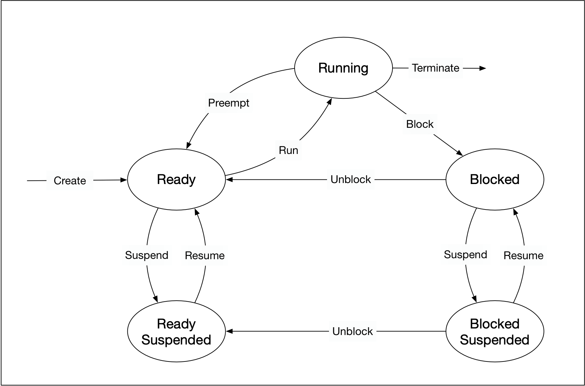

# 5. Concurrency
## 5.1. Processes and Threads
A **process** (also called a task) is a computer program at runtime. It is comprised of the runtime 
environment provided by the operating system (OS), as well as of the embedded binary code of the 
program during execution. A process is controlled by the OS through certain actions with which it 
sets the process into one of several carefully defined states:



* **Ready**: After its creation, a process enters the ready state and is loaded into main memory. The 
process now is ready to run and is waiting for CPU time to be executed. Processes that are ready for 
execution by the CPU are stored in a queue managed by the OS.
* **Running**: The operating system has selected the process for execution and the instructions within 
the process are executed on one or more of the available CPU cores.
* **Blocked**: A process that is blocked is one that is waiting for an event (such as a system resource 
becoming available) or the completion of an I/O operation.
* **Terminated**: When a process completes its execution or when it is being explicitly killed, it changes 
to the "terminated" state. The underlying program is no longer executing, but the process remains in the 
process table as a "zombie process". When it is finally removed from the process table, its lifetime ends.
* **Ready suspended**: A process that was initially in ready state but has been swapped out of main memory 
and placed onto external storage is said to be in suspend ready state. The process will transition back to 
ready state whenever it is moved to main memory again.
* **Blocked suspended**: A process that is blocked may also be swapped out of main memory. It may be swapped 
back in again under the same conditions as a "ready suspended" process. In such a case, the process will move 
to the blocked state, and may still be waiting for a resource to become available.

A **thread** represents a concurrent execution unit within a process. In contrast to full-blown processes 
as described above, threads are characterized as light-weight processes (LWP). These are significantly 
easier to create and destroy: In many systems the creation of a thread is up to 100 times faster than the 
creation of a process. This is especially advantageous in situations, when the need for concurrent operations 
changes dynamically.

A major *difference* between a process and a thread is that each process has its own address space, while a 
thread does not require a new address space to be created. All the threads in a process can access its shared 
memory. Threads also share other OS dependent resources such as processors, files, and network connections. As 
a result, the management overhead for threads is typically less than for processes. Threads, however, are not 
protected against each other and must carefully synchronize when accessing the shared process resources to 
avoid conflicts.

Similar to processes, threads exist in different states, which are illustrated in the figure below:


* **New**: A thread is in this state once it has been created. Until it is actually running, it will not 
take any CPU resources.
* **Runnable**: In this state, a thread might actually be running or it might be ready to run at any instant of 
time. It is the responsibility of the thread scheduler to assign CPU time to the thread.
* **Blocked**: A thread might be in this state, when it is waiting for I/O operations to complete. When 
blocked, a thread cannot continue its execution any further until it is moved to the runnable state again. 
It will not consume any CPU time in this state. The thread scheduler is responsible for reactivating the thread.

## 5.2. Running a Single Thread
A running program consists of at least one thread. When the main function is executed, we refer to it as the 
*main thread*. Threads are uniquely identified by their thread ID, which can be particularly useful for 
debugging a program. The following code prints the thread identifier of the main thread:

```cpp
#include <iostream>
#include <thread>

int main(){
    std::cout << "Hello concurrent world from main! Thread id = " << std::this_thread::get_id() << std::endl;

    return 0;
}
```

Also, it is possible to retrieve the number of available CPU cores of a system:

```cpp
#include <iostream>
#include <thread>

int main(){
    unsigned int nCores = std::thread::hardware_concurrency();
    std::cout << "This machine supports concurrency with " << nCores << " cores available" << std::endl;

    return 0;
}
```

### 5.2.1. Starting a second thread
In this section, we will start a second thread in addition to the main thread of our program. To do this, 
we need to construct a thread object and pass it the function we want to be executed by the thread. Once 
the thread enters the runnable state, the execution of the associated thread function may start at any 
point in time.

```cpp
// create thread
std::thread t(threadFunction);
```

After the thread object has been constructed, the main thread will continue and execute the remaining 
instructions until it reaches the end and returns. It is possible that by this point in time, the thread 
will also have finished. But if this is not the case, the main program will terminate and the resources of 
the associated process will be freed by the OS. As the thread exists within the process, it can no longer 
access those resources and thus not finish its execution as intended.

To prevent this from happening and have the main program wait for the thread to finish the execution of the 
thread function, we need to call `join()` on the thread object. This call will only return when the thread 
reaches the end of the thread function and block the main thread until then.

The following code shows how to use `join()` to ensure that `main()` waits for the thread `t` to finish 
its operations before returning. It uses the function `sleep_for()`, which pauses the execution of the 
respective threads for a specified amount of time. The idea is to simulate some work to be done in the 
respective threads of execution.

```cpp
#include <iostream>
#include <thread>

void threadFunction()
{
    std::this_thread::sleep_for(std::chrono::milliseconds(100)); // simulate work
    std::cout << "Finished work in thread\n"; 
}

int main()
{
    // create thread
    std::thread t(threadFunction);

    // do something in main()
    std::this_thread::sleep_for(std::chrono::milliseconds(50)); // simulate work
    std::cout << "Finished work in main\n";

    // wait for thread to finish
    t.join();

    return 0;
}
```

To compile this code with `g++`, you will need to use the `-pthread` flag. `pthread` adds support for 
multithreading with the pthreads library, and the option sets flags for both the preprocessor and linker:

```
g++ example_3.cpp -pthread
```

### 5.2.2. Randomness of events
The order of thread execution is up to OS scheduler and to the programmer it's random. In order to force 
the work flow to follow our desired flow, we can use `.join()` as a barrier when needed.

### 5.2.3. Detach
Let us now take a look at what happens if we don’t join a thread before its destructor is called. When we 
comment out join in the example above and then run the program again, it aborts with an error. The reason 
why this is done is that the designers of the C++ standard wanted to make debugging a multi-threaded program 
easier: Having the program crash forces the programmer to remember joining the threads that are created in a 
proper way. Such a hard error is usually much easier to detect than soft errors that do not show themselves 
so obviously.

There are some situations however, where it might make sense to not wait for a thread to finish its work. 
This can be achieved by *detaching* the thread, by which the internal state variable *joinable* is set to 
*false*. This works by calling the `detach()` method on the thread. The destructor of a detached thread 
does nothing: It neither blocks nor does it terminate the thread. In the following example, detach is called 
on the thread object, which causes the main thread to immediately continue until it reaches the end of the 
program code and returns. Note that a detached thread can not be joined ever again.

```cpp
#include <iostream>
#include <thread>

void threadFunction()
{
    std::this_thread::sleep_for(std::chrono::milliseconds(50)); // simulate work
    std::cout << "Finished work in thread\n"; 
}

int main()
{
    // create thread
    std::thread t(threadFunction);

    // detach thread and continue with main
    t.detach();

    // do something in main()
    std::this_thread::sleep_for(std::chrono::milliseconds(50)); // simulate work
    std::cout << "Finished work in main\n";

    return 0;
}
```

## 5.3. Starting a Thread with a Function Object
### 5.3.1. Functions and Callable Objects
In C++, callable objects are object that can appear as the left-hand operand of the 
call operator. These can be pointers to functions, objects of a class that defines an 
overloaded function call operator and lambdas (an anonymous inline function), with which 
function objects can be created in a very simple way. In the context of concurrency, we 
can use callable objects to attach a function to a thread.

### 5.3.2. Threads and Function Objects
The `std::thread` constructor can also be called with instances of classes that implement 
the function-call operator. In the following, we will thus define a class that has an 
overloaded ()-operator:

```cpp
#include <iostream>
#include <thread>

class Vehicle
{
public:
    void operator()()
    {
        std::cout << "Vehicle object has been created \n" << std::endl;
    }
};


int main()
{
    // create thread 
    std::thread t(Vehicle()); // C++'s most vexing parse

    // do something in main()
    std::cout << "Finished work in main \n";

    // wait for thread to finish
    t.join();

    return 0;
}
```

The above code generates the following error:

```
error: request for member ‘join’ in ‘t’, which is of non-class type ‘std::thread(Vehicle (*)())’
     t.join();
```

The expression was coined by Scott Meyers in 2001, who talks about it in details in his book 
"Effective STL". The *most vexing parse* comes from a rule in C++ that says that anything that 
could be considered as a function declaration, the compiler should parse it as a function declaration 
- even if it could be interpreted as something else.

In the previous code example, the line

```cpp
    // create thread 
    std::thread t(Vehicle());
```

is seemingly ambiguous, since it could be interpreted either as:

1. a variable definition for variable `t` of class `std::thread`, initialized with an anonymous 
instance of class `Vehicle` or
2. a function declaration for a function `t` that returns an object of type `std::thread` and has a single 
(unnamed) parameter that is a pointer to function returning an object of type `Vehicle`

Most programmers would presumable expect the first case to be true, but the C++ standard requires it to 
be interpreted as the second - hence the compiler warning.

There are three ways of forcing the compiler to consider the line as the first case, which would create 
the thread object we want:

1. Add an extra pair of parentheses
2. Use copy initialization
3. Use uniform initialization with braces

The following code shows all three variants:

```cpp
#include <iostream>
#include <thread>

class Vehicle
{
public:
    void operator()()
    {
        std::cout << "Vehicle object has been created \n" << std::endl;
    }
};


int main()
{
    // create thread 
    //std::thread t0(Vehicle()); // C++'s most vexing parse
    
    std::thread t1( (Vehicle()) ); // Add an extra pair of parantheses
    
    std::thread t2 = std::thread( Vehicle() ); // Use copy initialization
    
    std::thread t3{ Vehicle() };// Use uniform initialization with braces

    // do something in main()
    std::cout << "Finished work in main \n";

    // wait for thread to finish
    t1.join();
    t2.join();
    t3.join();

    return 0;
}
```

The output of this code sample shows that all three threads are executed and the `Vehicle` object 
is properly initialized.

Whichever option we use, the idea is the same: the function object is copied into internal storage 
accessible to the new thread, and the new thread invokes the operator `()`. The `Vehicle` class 
can of course have data members and other member functions too, and this is one way of passing data 
to the thread function: pass it in as a constructor argument and store it as a data member:

```cpp
#include <iostream>
#include <thread>

class Vehicle
{
public:
    Vehicle(int id) : _id(id) {}
    void operator()()
    {
        std::cout << "Vehicle #" << _id << " has been created" << std::endl;
    }

private:
    int _id;
};

int main()
{
    // create thread
    std::thread t = std::thread(Vehicle(1)); // Use copy initialization

    // do something in main()
    std::cout << "Finished work in main \n";

    // wait for thread to finish
    t.join();

    return 0;
}
```

### 5.3.3. Lambdas
Another very useful way of starting a thread and passing information to it is by using a lambda 
expression. With a Lambda you can easily create simple function objects.

A Lambda is often used as an argument for functions that can take a callable object. This can be 
easier than creating a named function that is used only when passed as an argument. In such cases, 
Lambdas are generally preferred because they allow the function objects to be defined inline. If 
Lambdas were not available, we would have to define an extra function somewhere else in our source 
file - which would work but at the expense of the clarity of the source code.

A Lambda is a function object (a "functor"), so it has a type and can be stored and passed around. 
Its result object is called a "closure", which can be called using the operator `()` as we will 
see shortly.

A lambda formally consists of three parts: 1. a capture list `[]` , 2. a parameter list `()` and 
3. a main part `{}`, which contains the code to be executed when the Lambda is called. Note that 
in principal all parts could be empty.

The *capture list `[]`*: By default, variables outside of the enclosing `{}` around the main part 
of the Lambda can not be accessed. By adding a variable to the capture list however, it becomes 
available within the Lambda either as a copy or as a reference. The captured variables become a 
part of the Lambda.

By default, variables in the capture block can not be modified within the Lambda. Using the keyword 
*mutable* allows to modify the parameters captured by copy, and to call their non-const member 
functions within the body of the Lambda. The following code examples show several ways of making the 
external variable "id" accessible within a Lambda:

```cpp
#include <iostream>

int main()
{
    // create lambdas
    int id = 0; // Define an integer variable

    //auto f0 = []() { std::cout << "ID = " << id << std::endl; }; // Error: 'id' cannot be accessed

    id++;
    auto f1 = [id]() { std::cout << "ID = " << id << std::endl; }; // OK, 'id' is captured by value

    id++;
    auto f2 = [&id]() { std::cout << "ID = " << id << std::endl; }; // OK, 'id' is captured by reference

    //auto f3 = [id]() { std::cout << "ID = " << ++id << std::endl; }; // Error, 'id' may not be modified

    auto f4 = [id]() mutable { std::cout << "ID = " << ++id << std::endl; }; // OK, 'id' may be modified

    // execute lambdas
    f1();
    f2();
    f4();

    return 0;
}
```

Even though we have been using Lambdas in the above example in various ways, it is important to note 
that a Lambda does not exist at runtime. The runtime effect of a Lambda is the generation of an object, 
which is known as *closure*. The difference between a Lambda and the corresponding closure is similar 
to the distinction between a class and an instance of the class. A class exists only in the source code 
while the objects created from it exist at runtime.

We can use (a copy of) the closure (i.e. f0, f1, …) to execute the code within the Lambda at a position 
in our program different to the line where the function object was created.

The *parameter list `()`*: The way parameters are passed to a Lambda is basically identical to calling 
a regular function. If the Lambda takes no arguments, these parentheses can be omitted (except when 
"mutable" is used). Example:

```cpp
#include <iostream>

int main()
{
    int id = 0; // Define an integer variable

    // create lambda
    auto f = [](const int id) { std::cout << "ID = " << id << std::endl; }; // ID is passed as a parameter

    // execute function object and pass the parameter
    f(id);

    return 0;
}
```

### 5.3.4. Starting Threads with Lambdas
A Lambda is, as we’ve seen, just an object and, like other objects it may be copied, passed as a 
parameter, stored in a container, etc. The Lambda object has its own scope and lifetime which may, 
in some circumstances, be different to those objects it has "captured". Programmers need to take 
special care when capturing local objects by reference because a Lambda’s lifetime may exceed the 
lifetime of its capture list: It must be ensured that the object to which the reference points is 
still in scope when the Lambda is called. This is especially important in multi-threading programs.

So let us start a thread and pass it a Lambda object to execute:

```cpp
#include <iostream>
#include <thread>

int main()
{
    int id = 0; // Define an integer variable

    // starting a first thread (by reference)
    auto f0 = [&id]() {
        std::this_thread::sleep_for(std::chrono::milliseconds(100));
        std::cout << "a) ID in Thread (call-by-reference) = " << id << std::endl;
    };
    std::thread t1(f0);

    // starting a second thread (by value)
    std::thread t2([id]() mutable {
        std::this_thread::sleep_for(std::chrono::milliseconds(50));
        std::cout << "b) ID in Thread (call-by-value) = " << id << std::endl;
    });

    // increment and print id in main
    ++id;
    std::cout << "c) ID in Main (call-by-value) = " << id << std::endl;

    // wait for threads before returning
    t1.join();
    t2.join();

    return 0;
}
```

The output of the program looks like this

```
c) ID in Main (call-by-value) = 1
b) ID in Thread (call-by-value) = 0
a) ID in Thread (call-by-reference) = 1
```

As you can see, the output in the main thread is generated first, at which point the variable ID 
has taken the value 1. Then, the call-by-value thread is executed with ID at a value of 0. Then, 
the call-by-reference thread is executed with ID at a value of 1. This illustrates the effect of 
passing a value by reference : when the data to which the reference refers changes before the thread 
is executed, those changes will be visible to the thread. We will see other examples of such behavior 
later in the course, as this is a primary source of concurrency bugs.

## 5.4. Starting a Thread with Variadic Templates and Member Functions
### 5.4.1. Passing Arguments using a Variadic Templates
In the previous section, we have seen that one way to pass arguments in to the thread function is to 
package them in a class using the function call operator. Even though this worked well, it would be 
very cumbersome to write a special class every time we need to pass data to a thread. We can also use 
a Lambda that captures the arguments and then calls the function. But there is a simpler way: The thread 
constructor may be called with a function and all its arguments. That is possible because the thread 
constructor is a variadic template that takes multiple arguments.

Before C++11, classes and functions could only accept a fixed number of arguments, which had to be 
specified during the first declaration. With variadic templates it is possible to include any number 
of arguments of any type.

```cpp
#include <iostream>
#include <thread>
#include <string>

void printID(int id)
{
    std::this_thread::sleep_for(std::chrono::milliseconds(50));
    std::cout << "ID = " << id << std::endl;
    
}

void printIDAndName(int id, std::string name)
{
    std::this_thread::sleep_for(std::chrono::milliseconds(100));
    std::cout << "ID = " << id << ", name = " << name << std::endl;
}

int main()
{
    int id = 0; // Define an integer variable

    // starting threads using variadic templates
    std::thread t1(printID, id);
    std::thread t2(printIDAndName, ++id, "MyString");
    std::thread t3(printIDAndName, ++id); // this procudes a compiler error

    // wait for threads before returning
    t1.join();
    t2.join();
    //t3.join();


    return 0;
}
```

There is one more difference between calling a function directly and passing it to a thread: With 
the former, arguments may be passed by value, by reference or by using move semantics - depending 
on the signature of the function. When calling a function using a variadic template, the arguments 
are by default either moved or copied - depending on whether they are rvalues or lvalues. There are 
ways however which allow us to overwrite this behavior. If you want to move an lvalue for example, 
we can call `std::move`. In the following example, two threads are started, each with a different 
string as a parameter. With `t1`, the string `name1` is copied by value, which allows us to print 
`name1` even after join has been called. The second string `name2` is passed to the thread function 
using move semantics, which means that it is not available any more after join has been called on `t2`.

```cpp
#include <iostream>
#include <thread>
#include <string>

void printName(std::string name, int waitTime)
{
    std::this_thread::sleep_for(std::chrono::milliseconds(waitTime));
    std::cout << "Name (from Thread) = " << name << std::endl;
}

int main()
{
    std::string name1 = "MyThread1";
    std::string name2 = "MyThread2";

    // starting threads using value-copy and move semantics 
    std::thread t1(printName, name1, 50);
    std::thread t2(printName, std::move(name2), 100);

    // wait for threads before returning
    t1.join();
    t2.join();

    // print name from main
    std::cout << "Name (from Main) = " << name1 << std::endl;
    std::cout << "Name (from Main) = " << name2 << std::endl;

    return 0;
}
```

The console output shows how using copy-by-value and `std::move` affect the string parameters:

```
Name (from Thread) = MyThread1
Name (from Thread) = MyThread2
Name (from Main) = MyThread1
Name (from Main) = 
```

In the following example, the signature of the thread function is modified to take a non-const 
reference to the string instead:

```cpp
#include <iostream>
#include <thread>
#include <string>

void printName(std::string &name, int waitTime)
{
    std::this_thread::sleep_for(std::chrono::milliseconds(waitTime));
    name += " (from Thread)";
    std::cout << name << std::endl;
}

int main()
{
    std::string name("MyThread");

    // starting thread
    std::thread t(printName, std::ref(name), 50);

    // wait for thread before returning
    t.join();

    // print name from main
    name += " (from Main)";
    std::cout << name << std::endl;

    return 0;
}
```

When passing the string variable `name` to the thread function, we need to explicitly mark it as a 
reference, so the compiler will treat it as such. This can be done by using the `std::ref` function. 
In the console output it becomes clear that the string has been successfully modified within the 
thread function before being passed to main.

```
MyThread (from Thread)
MyThread (from Thread) (from Main)
Process exited with code 0.
```

### 5.4.2. Starting Threads with Member Functions
In the previous sections, you have seen how to start threads with functions and function objects, 
with and without additional arguments. Also, you now know how to pass arguments to a thread function 
by reference. But what if we wish to run a member function other than the function call operator, such 
as a member function of an existing object? Luckily, the C++ library can handle this use-case: For 
calling member functions, the `std::thread` function requires an additional argument for the object 
on which to invoke the member function.

```cpp
#include <iostream>
#include <thread>

class Vehicle
{
public:
    Vehicle() : _id(0) {}
    void addID(int id) { _id = id; }
    void printID()
    {
        std::cout << "Vehicle ID=" << _id << std::endl;
    }

private:
    int _id;
};

int main()
{
    // create thread
    Vehicle v1, v2;
    std::thread t1 = std::thread(&Vehicle::addID, v1, 1); // call member function on object v
    std::thread t2 = std::thread(&Vehicle::addID, &v2, 2); // call member function on object v

    // wait for thread to finish
    t1.join();
    t2.join();

    // print Vehicle id
    v1.printID();
    v2.printID();

    return 0;
}
```

In the example above, the Vehicle object `v1` is passed to the thread function by value, thus a copy 
is made which does not affect the *original* living in the main thread. Changes to its member 
variable `_id` will thus not show when printing calling `printID()` later in main. The second 
Vehicle object `v2` is instead passed by reference. Therefore, changes to its `_id` variable will 
also be visible in the main thread - hence the following console output:

```
Vehicle ID=0
Vehicle ID=2
Process exited with code 0.
```

In the previous example, we have to ensure that the existence of `v2` outlives the completion of 
the thread `t2` - otherwise there will be an attempt to access an invalidated memory address. An 
alternative is to use a heap-allocated object and a reference-counted pointer such as 
`std::shared_ptr<Vehicle>` to ensure that the object lives as long as it takes the thread to finish 
its work. The following example shows how this can be implemented:

```cpp
#include <iostream>
#include <thread>

class Vehicle
{
public:
    Vehicle() : _id(0) {}
    void addID(int id) { _id = id; }
    void printID()
    {
        std::cout << "Vehicle ID=" << _id << std::endl;
    }

private:
    int _id;
};

int main()
{
    // create thread
    std::shared_ptr<Vehicle> v(new Vehicle);
    std::thread t = std::thread(&Vehicle::addID, v, 1); // call member function on object v
    
    // wait for thread to finish
    t.join();
    
    // print Vehicle id
    v->printID();
    
    return 0;
}
```

## 5.5. Running Multiple Threads
### 5.5.1. Fork-Join Parallelism
Using threads follows a basic concept called "fork-join-parallelism". The basic mechanism of 
this concept follows a simple three-step pattern:

1. Split the flow of execution into a parallel thread ("fork")
2. Perform some work in both the main thread and the parallel thread
3. Wait for the parallel thread to finish and unite the split flow of execution again ("join")

The following diagram illustrates the basic idea of forking:


In the following example, a number of threads is created and added to a vector. The basic idea 
is to loop over the vector at the end of the main function and call join on all the thread objects 
inside the vector.

```cpp
#include <iostream>
#include <thread>
#include <vector>

void printHello()
{
    // perform work
    std::cout << "Hello from Worker thread #" << std::this_thread::get_id() << std::endl;
}

int main()
{
    // create threads
    std::vector<std::thread> threads;
    for (size_t i = 0; i < 5; ++i)
    {
        // copying thread objects causes a compile error
        /*
        std::thread t(printHello);
        threads.push_back(t); 
        */

        // moving thread objects will work
        threads.emplace_back(std::thread(printHello));
    }

    // do something in main()
    std::cout << "Hello from Main thread #" << std::this_thread::get_id() << std::endl;

    // call join on all thread objects using a range-based loop
    for (auto &t : threads)
        t.join();

    return 0;
}
```

When we try to compile the program using the `push_back()` function (which is the usual way 
in most cases), we get a compiler error. The problem with our code is that by pushing the 
thread object into the vector, we attempt to make a copy of it. However, thread objects do not 
have a copy constructor and thus can not be duplicated. If this were possible, we would create 
yet another branch in the flow of execution - which is not what we want. The solution to this problem 
is to use move semantics, which provide a convenient way for the contents of objects to be 'moved' 
between objects, rather than copied.

To solve our problem, we can use the function `emplace_back()` instead of `push_back()`, which internally 
uses move semantics to move our thread object into the vector without making a copy. When executing the 
code, we get the following output:

```
Hello from Worker thread #Hello from Worker thread #140370329347840140370337740544
Hello from Worker thread #140370320955136
Hello from Worker thread #140370346133248

Hello from Main thread #140370363660096
Hello from Worker thread #140370312562432
```


